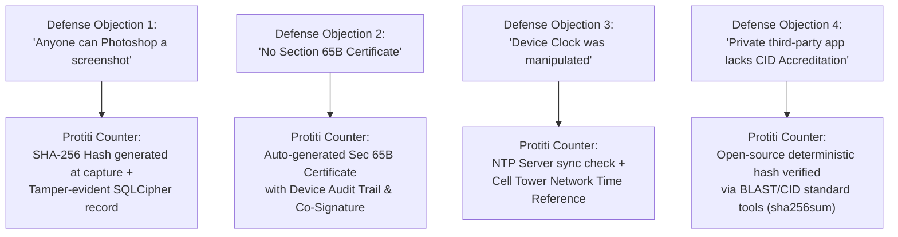

# Bangladesh Cyber Law & Digital Evidence Dossier: Project Protiti
**Document Reference:** PROTITI-LEG-2026-V1  
**Jurisdiction:** People's Republic of Bangladesh  
**Governing Laws:** Cyber Protection Act, 2026; Pornography Control Act, 2012; Evidence Act, 1872 (as amended by Evidence (Amendment) Act, 2022); Code of Criminal Procedure (CrPC), 1898.  
**Audience:** Legal Counsels, Forensic Engineers, Product Leads, Fellowship Pitch Defense Team  

---

## Executive Summary

Project Protiti operates at the critical intersection of legal recourse and digital forensics in Bangladesh. The repeal of the Cyber Security Act (CSA) 2023 and the enactment of the **Cyber Protection Act, 2026** marks a paradigm shift from broad-spectrum state surveillance toward rights-focused, gender-protective digital enforcement. However, securing convictions in Bangladesh's eight Divisional Cyber Tribunals remains notoriously difficult due to archaic evidentiary hurdles and aggressive cross-examination by defense counsels challenging digital integrity.

This dossier provides:
1. A rigorous statutory analysis of the **Cyber Protection Act, 2026** and **Pornography Control Act, 2012**.
2. Evidentiary admissibility standards under the **Evidence (Amendment) Act, 2022** (Sections 65A, 65B equivalents, and Section 22A).
3. Cryptographic and forensic chain-of-custody protocols adhering to **CID Forensic Lab (Criminal Investigation Department)** benchmarks and **ISO/IEC 27037**.
4. Concrete technical countermeasures designed to withstand judicial scrutiny and defense cross-examination.

---

## 1. Statutory Architecture

```
                               ┌─────────────────────────────────────────────────────────┐
                               │           Bangladesh Legal Framework (2026)             │
                               └────────────────────────────┬────────────────────────────┘
                                                            │
                 ┌──────────────────────────────────────────┼────────────────────────────────────────┐
                 ▼                                          ▼                                        ▼
   ┌───────────────────────────┐              ┌───────────────────────────┐            ┌───────────────────────────┐
   │ Cyber Protection Act 2026 │              │Pornography Control Act '12│            │Evidence (Amend.) Act 2022 │
   ├───────────────────────────┤              ├───────────────────────────┤            ├───────────────────────────┤
   │ • Sec 25: Blackmail /     │              │ • Sec 8(1)-(2): Production│            │ • Sec 65A/B: Electronic   │
   │   Cyber Harassment/AI     │              │   & Transmission          │            │   Record Admissibility    │
   │ • Sec 40: Takedown & Inter-│             │ • Sec 8(3): Blackmail /   │            │ • Sec 22A: Oral Evidence  │
   │   mediary Preservation   │              │   Extortion via Sex Media │            │ • Sec 45A: Digital Expert │
   │ • Non-Bailable / Cogniz.  │              │ • Non-Bailable & Cogniz.  │            │   Forensic Certificates   │
   └───────────────────────────┘              └───────────────────────────┘            └───────────────────────────┘
```

### 1.1 Cyber Protection Act, 2026: Comprehensive Breakdown

The Cyber Protection Act, 2026 was promulgated following extensive stakeholder consultations to eliminate draconian speech-policing clauses while aggressively arming law enforcement and judicial tribunals against **Gender-Based Cyber Violence (GBCV)**, non-consensual intimate image (NCII) diffusion, and synthetic identity weaponization.

#### Key Provisions for Gender-Based Cyber Harassment:

| Section | Offence Description | Offence Classification | Penalty (Custodial + Pecuniary) | Courtroom Standard of Proof |
| :--- | :--- | :--- | :--- | :--- |
| **Section 25** | Digital Blackmail, Sextortion, and Cyber Harassment | **Cognizable & Non-Bailable** | Imprisonment up to **7 years**, fine up to **BDT 1,000,000**, or both. Repeat offenders: Up to **10 years** / BDT 2,500,000. | Proof of transmission, identity of creator/distributor, coercive intent, mental distress or reputational ruin. |
| **Section 25(A)** | Synthetic Media, Generative AI Impersonation & Deepfakes | **Cognizable & Non-Bailable** | Imprisonment up to **5 years**, fine up to **BDT 700,000**. | Proof that image/voice/video was fabricated or altered without victim's consent to depict compromising, sexual, or defamatory acts. |
| **Section 28** | Cyberstalking, Persistent Electronic Intimidation | **Cognizable & Bailable (1st offense)**; Non-Bailable (Repeat) | Imprisonment up to **2 years**, fine up to **BDT 300,000**. | Pattern of repeated unwanted electronic communications inducing reasonable apprehension of danger. |
| **Section 40** | Emergency Preservation & Platform Intermediary Duty | Regulatory / Mandatory Directives | Penalty on platforms/intermediaries: Fines up to **BDT 5,000,000** for willful destruction of evidence after notice. | Certified electronic preservation notice issued by investigating officer or court. |
| **Section 43** | Search, Seizure & Device Impoundment Powers | Procedural Powers | Authorizes Investigating Officers (IO) to seize mobile devices, hard drives, and SIM cards without prior warrant in exigent circumstances. | Seizure memo (*Jobdo Talika*) with independent witnesses required under CrPC Section 103. |

> [!IMPORTANT]
> **Cognizable vs. Non-Cognizable Strategic Distinction:**
> Under Section 25 and Section 25(A), offenses are **Cognizable** under the Code of Criminal Procedure (CrPC) 1898. This means the Police Officer-in-Charge (OC) is **statutorily mandated to register a First Information Report (FIR)** upon submission of credible complaint without requiring prior Magistrate permission (CrPC Section 154 vs 155). 
> When Protiti users file an e-GD, if the facts disclose a cognizable offense under Section 25 of the 2026 Act, the GD **must be converted into an FIR** by the Thana.

---

### 1.2 Pornography Control Act, 2012 (পর্নোগ্রাফি নিয়ন্ত্রণ আইন, ২০১২)

In cases involving explicit images, videos, bedroom blackmail, or revenge pornography, the **Pornography Control Act, 2012** runs **concurrently** with the Cyber Protection Act, 2026. Public prosecutors frequently charge both to prevent the accused from obtaining bail.

*   **Section 2(ga) — Definition of Pornography:** Encompasses any film, video, audio-visual display, photograph, digital image, or digitally altered graphic depicting human sexual intercourse, explicit genital exhibition, or sexually stimulating postures created or distributed without lawful justification.
*   **Section 8(1) & 8(2) — Production and Transmission:** Prohibits production, reproduction, distribution, and transmission through electronic media or mobile networks. Penalty: Imprisonment up to **5 years** and fine up to **BDT 200,000**.
*   **Section 8(3) — Blackmail & Extortion via Pornography / Intimate Media:**
    *   *Statutory Language:* If any person uses pornography, explicit media, or synthetic sexual imagery to blackmail, extort money, demand sexual favors, or defame another person.
    *   *Classification:* **Non-Bailable and Cognizable**.
    *   *Penalty:* Imprisonment up to **7 years** and fine up to **BDT 500,000**.
*   **Section 8(4) — Offences Against Women and Children:** Imposes aggravated punishment (imprisonment up to **10 years**).
*   **Section 9 — Confiscation and Forfeiture:** All devices, computers, and digital media involved are liable to judicial confiscation and permanent destruction upon conviction.

---

## 2. Digital Admissibility in Bangladesh Courts: Evidence Act Standards

Defense lawyers in Bangladesh regularly defeat digital harassment cases on a single procedural ground: **Defective Admissibility of Secondary Electronic Evidence**.

### 2.1 The Landmark Evidence (Amendment) Act, 2022

Prior to 2022, the Evidence Act, 1872 strictly favored primary physical documents (Sections 61–65). The **Evidence (Amendment) Act, 2022 (Act No. XVIII of 2022)** modernized Bangladeshi judicial procedure:

1.  **Section 65A & 65B Equivalents (Admissibility of Electronic Records):**
    *   Information contained in an electronic record (printout, optical/magnetic media, device screen dump) is deemed to be a **document** and admissible in proceedings without further proof or production of the original physical server, **PROVIDED** statutory conditions are met:
        1.  The computer/device was produced during period of regular use.
        2.  Information of that kind was regularly fed into or processed by the system.
        3.  Throughout the material part of the period, the computer was operating properly (or interruptions did not affect integrity).
        4.  The output reproduces or is derived from information fed into the system in ordinary course.
    *   **Mandatory Requirement: Section 65B Certificate of Integrity.** The electronic evidence *must* be accompanied by a signed Certificate by a person holding an official or responsible technical position managing the device or forensic process.
2.  **Section 22A — Inadmissibility of Oral Admissions:**
    *   Oral testimony regarding the contents of digital communications (e.g., victim stating "he sent me this message on WhatsApp") is **irrelevant and inadmissible** unless the genuineness of the record is first established through forensic documentation.
3.  **Section 45A — Expert Forensic Opinion:**
    *   Empowers the court to admit opinions of certified digital forensic experts (specifically CID Forensic Lab, National Cyber Security Agency, or court-accredited forensic examiners).
4.  **Sections 85A, 85B, 88A — Presumptions of Electronic Records:**
    *   Establishes legal presumptions regarding digital signatures, secure electronic records, and electronic messages sent via telecom service providers.

---

## 3. The Digital Chain-of-Custody (CoC) Protocol for Protiti

To ensure that evidence generated by Project Protiti is **courtroom-bulletproof**, the mobile application implements strict compliance with **ISO/IEC 27037** (Guidelines for identification, collection, acquisition, and preservation of digital evidence) and **Bangladesh CID Digital Forensics Standard Operating Procedures (SOP)**.

```
┌────────────────────────────────────────────────────────────────────────────────────────┐
│                        Protiti Evidence Acquisition Pipeline                           │
└───────────────────────────────────┬────────────────────────────────────────────────────┘
                                    │
    ┌───────────────────────────────┴───────────────────────────────┐
    ▼                                                               ▼
1. Forensic Ingestion                               2. Cryptographic Integrity
   • Raw Screenshot / Media File                       • SHA-256 Bitwise Cryptographic Hash
   • Full EXIF & Metadata Extraction                   • UTC Hardware & NTP Atomic Timestamp
   • Source URL & Sender ID Parsing                    • Anti-Tamper Salt & App Signature
    │                                                               │
    └───────────────────────────────┬───────────────────────────────┘
                                    │
                                    ▼
3. Evidence Manifest Packaging
   • RFC 3161-compliant Trusted Timestamping
   • Secure SQLite (SQLCipher) Storage with AES-256
   • Hardware Keystore / Keyring Bound Key
                                    │
                                    ▼
4. Court-Ready Section 65B Export
   • Cryptographically Signed PDF Dossier
   • Verifiable SHA-256 Integrity Manifest
   • Forensic Chain-of-Custody Event Audit Log
```

### 3.1 Metadata Preservation Matrix

Screenshots taken carelessly via standard Android/iOS mechanisms strip web-page HTTP headers and fail to record origin servers. Protiti's custom Capture Engine preserves:

| Evidentiary Dimension | Data Captured by Protiti | Forensic Utility in Cross-Examination |
| :--- | :--- | :--- |
| **Bitwise Integrity** | SHA-256 (256-bit hash) + SHA-512 dual hashing | Proves file has not been altered by 1 single bit since moment of ingestion. |
| **Temporal Verification** | ISO 8601 UTC timestamp + Device Uptime + NTP Server verification | Defeats defense claims that victim altered device system clock to forge timelines. |
| **Origin / Network Routing** | Exact HTTP/HTTPS URL, platform handle/UID, Reverse DNS lookup (when available) | Establishes transmission channel and targets platform preservation subpoenas. |
| **Hardware State** | Android/iOS OS build number, Device UUID hash, SQLCipher DB row ID | Proves capture occurred within isolated sandbox, preventing local malware injections. |
| **Exclusivity of Access** | Biometric/PIN authentication logs with timestamped session tokens | Establishes that only the authorized user accessed the vault. |

---

## 4. Defeating Defense Cross-Examination in Cyber Tribunals

The following table trains the Project Protiti pitch team and cooperating legal attorneys to neutralize common defense tactics used in Bangladeshi Cyber Tribunals:



### Detailed Cross-Examination Scenarios & Defense Strategies:

#### Scenario A: "The Screenshot Fabrication Attack"
*   **Defense Lawyer Objection:** *"Your Honor, a screenshot is merely an unverified bitmap image. Any high school student with Photoshop, Canva, or browser 'Inspect Element' can create a fake Facebook message in 60 seconds. This screenshot does not prove my client sent anything."*
*   **Protiti Evidentiary Answer:**
    1.  The evidence is not presented as an isolated PNG file; it is bound inside an immutable **Protiti Cryptographic Forensic Package**.
    2.  At the microsecond of acquisition, an unalterable SHA-256 hash was generated (`e.g., a8f5c...3b`) and immediately committed to an encrypted database secured by hardware Keystore keys.
    3.  The package contains the **target profile's unique numerical UID** and **canonical URL** (not just vanity display names which can be cloned), enabling the Investigating Officer (IO) to cross-reference BTRC IP log records.
    4.  Under Evidence Act Section 65B, the printout bears an automated technical declaration verifying hardware state and cryptographic constancy.

#### Scenario B: "The Hearsay & Chain-of-Custody Attack"
*   **Defense Lawyer Objection:** *"The victim kept this file on her personal phone for two months before bringing it to the Thana. Who knows what third parties handled the phone or altered the file? The chain of custody is broken."*
*   **Protiti Evidentiary Answer:**
    1.  Protiti maintains an **Append-Only Tamper-Evident Audit Log**. Every time the evidence is viewed, exported, or verified, an audit record with timestamp and cryptographic signature is logged.
    2.  The SHA-256 checksum calculated in open court or by the CID Forensic Lab matches identically with the hash computed on the day of harassment. If a single pixel had been edited, the hash would change completely (Avalanche Effect).

#### Scenario C: "The Incompetent App / Uncertified Tool Attack"
*   **Defense Lawyer Objection:** *"What is 'Project Protiti'? Has this commercial or hackathon app been certified by the Bangladesh Government or CID? A private app's output cannot be admitted under Section 45A."*
*   **Protiti Evidentiary Answer:**
    1.  Protiti does not rely on proprietary, closed "magic" hashing. It employs the **NIST FIPS 180-4 standard SHA-256 algorithm**, the identical cryptographic standard utilized by the **CID Forensic Lab** and international law enforcement (Interpol, Europol).
    2.  The hash can be independently verified on the courtroom bench using any open-source CLI utility (`sha256sum`) on any independent computer.
    3.  Protiti operates in institutional partnership with **BLAST (Bangladesh Legal Aid and Services Trust)**, whose accredited cyber advocates provide institutional co-certification of the extraction process.

---

## 5. Technical-Legal Implementation Guidelines for Engineering

To maintain this legal standing, the Protiti engineering team must adhere to four immutable architectural rules:

1.  **Zero Loss of Native File Data:** When users import or capture evidence, the file must be stored bit-for-bit. Never apply compression (such as JPEG re-compression) after hash computation.
2.  **Isolated Key Storage:** Database encryption keys for SQLCipher must reside in `Android KeyStore` / `iOS Keychain`, inaccessible to root or user extraction without biometric authorization.
3.  **RFC 3161 Trusted Time Stamping:** When network is available, fetch cryptographic time tokens from an accredited public NTP/Timestamp Authority (e.g., Cloudflare Roughtime, Bangladesh Submarine Cable Company NTP) to eliminate local clock tampering arguments.
4.  **Decoy Vault Separation:** The Duress/Decoy PIN must write to an entirely isolated SQLite database instance. The decoy database must contain zero references, foreign keys, or metadata pointing to the true encrypted vault, preventing forensic discovery of hidden partition records.

---

*Authored by Senior Legal Advisor Agent, Project Protiti.*  
*DKC Fellowship 2026 — Legal & Forensics Division.*
