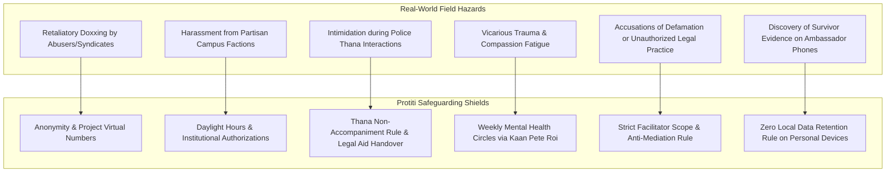
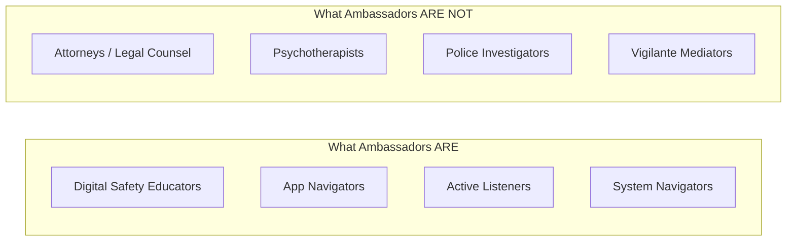
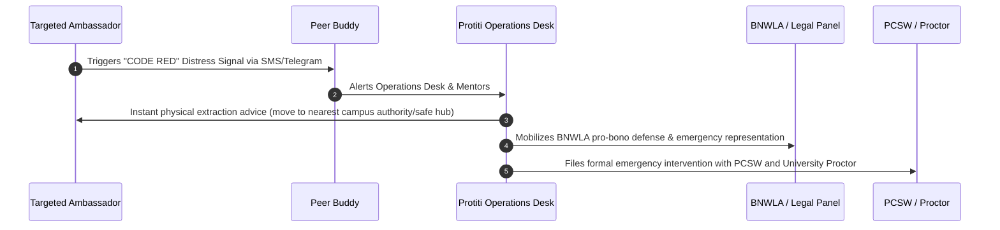

# Project Protiti (প্রতীতি) — Ambassador Safeguarding & Duty of Care Protocol
**Protection Guidelines for Female University Students Conducting Peer Support**
*DKC Digital Respect & Cohesion Fellowship 2026 | UNDP Bangladesh, EU & SURGE*

---

## 1. Context & Threat Modeling

Peer support by female university students is the core grassroots engine of Project Protiti. However, operating at the intersection of online gender-based violence (OGBV), blackmail, and socio-cultural stigma carries acute risks. A careless or unprotected outreach model can expose student ambassadors to severe hazards:



To eliminate these vulnerabilities, every Ambassador certified under the **Train-the-Trainer (ToT)** program is contractually bound by this Safeguarding Protocol.

---

## 2. The Five Pillars of Ambassador Safeguarding

### Pillar 1: Identity Protection & Operational Anonymity
Female students must never compromise their personal life, academic standing, or safety to provide peer support.

* **Operational Pseudonyms & Badge Names:** When conducting campus kiosks, hall seminars, or answering community queries, ambassadors use official first-name badges with Project Protiti identifiers (e.g., "Ambassador Ayesha - Dhaka Hub") rather than full legal names or student registration IDs.
* **No Personal Contact Information:**
  * Ambassadors are **strictly prohibited** from sharing personal mobile numbers, personal Facebook profiles, WhatsApp, or Instagram accounts with survivors or campus audiences.
  * All peer communications must pass through dedicated, project-issued Teletalk/Grameenphone SIMs or verified Telegram public channels (`@ProtitiSupport_Dhaka`, etc.).
* **Social Media Blackout on Live Cases:** Ambassadors must never post case details, screenshots, survivor identities, or campus kiosk participant lists on personal social media channels, even with names blurred.

---

### Pillar 2: Physical Security & The "Rule of Two" (Buddy System)
Ambassadors never operate alone in physical field environments.

```
┌────────────────────────────────────────────────────────────────────────┐
│                   PHYSICAL FIELD SAFETY MANDATES                       │
├────────────────────────────────────────────────────────────────────────┤
│ 1. THE RULE OF TWO: Always travel and operate in pairs (min 2 fellows) │
│ 2. SANCTIONED HOURS: 09:00 AM – 05:30 PM only (Strict daylight rule)   │
│ 3. PUBLIC VENUES ONLY: University lounges, libraries, seminar rooms    │
│ 4. NEVER ENTER PRIVATE MESS: No unmonitored off-campus dorm rooms      │
│ 5. NO POLICE STATION LOBBYING: Hand over court cases to BNWLA/BLAST    │
└────────────────────────────────────────────────────────────────────────┘
```

* **The Rule of Two:** All outreach activities—whether setting up a digital safety desk in a dormitory or distributing toolkits—must be conducted by a minimum of two certified ambassadors.
* **Daylight Operating Window:** Field activities are strictly limited to daylight hours (09:00 AM to 05:30 PM). No ambassador is authorized to conduct project engagements after dark.
* **Vetted, Neutral Venues Only:** Kiosks and peer circles may only be held in institutional, high-visibility public spaces: university central libraries, residential hall common rooms (with Provost notice), department seminar rooms, or recognized NGO offices (BRAC, BNWLA). Private dorm rooms, off-campus male boarding houses ("mess"), or secluded cafes are strictly off-limits.
* **The "Thana Non-Accompaniment" Directive:**
  * Ambassadors are **not** law enforcement escorts or paralegals.
  * Ambassadors must **NEVER** accompany a survivor into a police station (*Thana*) to confront police officers.
  * *Procedure:* When a survivor has generated a General Diary (GD) draft through Protiti, the ambassador routes the survivor to:
    1. The online e-GD portal (`gd.police.gov.bd`), or
    2. A designated BNWLA or BLAST female panel lawyer who provides formal legal accompaniment, or
    3. The University Proctorial Body / Sexual Harassment Prevention Committee.

---

### Pillar 3: Data Security & Zero Survivor Data Retention
Retaining another person's evidence of sexual harassment or blackmail is a severe legal and personal liability.

* **The Zero-Retention Rule:** Ambassadors are **strictly forbidden** from receiving, storing, transmitting, or holding any survivor evidence (screenshots, photos, audio clips, video files) on their personal smartphones, laptops, flash drives, or cloud storage.
* **Survivor Device Exclusivity:** All app downloads, vault configurations, and evidence captures must occur exclusively on the survivor's own smartphone.
* **No Cloud Passing:** Ambassadors must never instruct a survivor to "WhatsApp me the screenshots so I can check them."
* **Immediate Deletion of Unsolicited Evidence:** If a panicked user sends intimate or extortive media to a project channel or ambassador inbox, the ambassador must immediately reply with the standard refusal script, instruct the survivor to store it directly in their own Protiti vault, and permanently delete the received media from device cache and message history.

---

### Pillar 4: Role Boundaries & The Anti-Mediation Rule
Ambassadors must never overstep their mandate.



* **The Anti-Mediation Rule (Strict Prohibition):** Ambassadors must **NEVER** contact the perpetrator, call the blackmailer, message an abusive partner, or attempt to negotiate or mediate the dispute. Confronting an abuser frequently escalates physical violence or triggers retaliatory online leaking.
* **No Legal Advice:** Ambassadors provide legal *information* (e.g., explaining Section 25 of the Cyber Protection Act 2026), but must state clearly: *"I am a peer ambassador, not an advocate. Only a licensed lawyer can advise on legal strategy."*
* **Time Caps for Well-Being:** To safeguard academic focus, ambassadors are capped at a maximum of **4 hours of project activity per week**.

---

### Pillar 5: Vicarious Trauma Mitigation & Mental Health Duty of Care
Listening to disclosures of digital abuse, revenge porn, and threats can cause acute secondary trauma.

* **Weekly Decompression Circles:** Every Thursday evening, all active divisional ambassadors participate in a mandatory 45-minute virtual decompression session led by an accredited counselor from **Kaan Pete Roi** (Emotional Support Helpline).
* **The "Tap-Out" Privilege:** Any ambassador who feels emotionally overwhelmed, triggered, or exhausted has the unconditional right to "tap out" and take a 14-day leave of absence with zero penalty or loss of fellowship standing.
* **Immediate Suicide Escalation Protocol:** If a student survivor reveals active suicidal ideation or intent during an outreach interaction:
  1. Do not leave the survivor alone.
  2. Maintain calm, compassionate physical presence.
  3. Immediately conference-call the Kaan Pete Roi helpline (**01779554391** / **01779554392**) or dial National Emergency Services (**999**).
  4. Alert the University Medical Centre / Hall House Tutor.

---

## 3. Triage & Emergency Escalation Matrix

Ambassadors follow a standardized, four-tiered traffic light escalation protocol:

| Tier Level | Scenario Indicators | Immediate Ambassador Action | Primary Referral Partner |
|---|---|---|---|
| 🟢 **Tier 1: Informational** | Student seeking digital hygiene check, app walkthrough, curiosity about Cyber Protection Act 2026 | Guide through Protiti app features, test Duress PIN, hand over printed survivor wallet card | Peer Ambassador / Protiti Knowledge Base |
| 🟡 **Tier 2: Active Harassment (Non-Emergency)** | Ongoing unwanted calls, fake Facebook profile, persistent offensive messages without immediate physical threats | Assist user in documenting evidence within local vault; generate structured GD draft; guide user to e-GD portal | Bangladesh Police e-GD (`gd.police.gov.bd`) / Local BLAST Clinic |
| 🟠 **Tier 3: Extortion & Deepfake Blackmail** | Demand for money under threat of publishing private photos; AI deepfake distribution; workplace/dorm defamation | Secure evidence in vault with SHA-256 hash; DO NOT delete chat; route immediately to specialized women's cyber desk | **Police Cyber Support for Women (PCSW)**<br>Hotline: `01320000888`<br>Email: `cyberhelp@police.gov.bd`<br>Legal Counsel: **BNWLA** |
| 🔴 **Tier 4: Immediate Danger / Self-Harm** | Physical stalker at dormitory gate, immediate domestic violence threat, suicidal intent | Call emergency services immediately; ensure user is in public/safe place with friends or university authority | **National Emergency Service (999)**<br>Suicide Helpline: **Kaan Pete Roi** (`01779554391`)<br>Hall Provost / Proctor |

---

## 4. Emergency "Red Alert" Protocol for Ambassadors in Distress

If an ambassador faces direct intimidation, cyber-stalking, physical following, or harassment as a result of their fellowship activities:



* **Distress Trigger Keyword:** Sending `PROTITI_SAFE` via SMS or Telegram to the dedicated National Coordinator line triggers an immediate emergency response.
* **Institutional Shield:** SURGE / UNDP PTIB fellowship management and university proctorial offices are immediately notified to provide administrative and physical protection on campus.
* **Pro-Bono Legal Defense:** BNWLA and BLAST immediately provide free legal representation if an ambassador faces retaliatory legal notices or police questioning.

---

## 5. Ambassador Code of Conduct & Pledge

Before receiving certification, every campus ambassador must sign the following formal pledge:

> **The Protiti Ambassador Pledge:**  
> *"I commit to upholding the dignity, privacy, and autonomy of every woman who approaches me. I will maintain absolute confidentiality. I will never keep survivor evidence on my personal device. I will never mediate with abusers. I will act strictly within my role as a peer educator, and I will prioritize my own safety and well-being, knowing that I cannot protect others if I do not protect myself."*

---
*Developed under the guidance of BNWLA Legal Counsel & Kaan Pete Roi Psychosocial Advisors | Project Protiti 2026*
