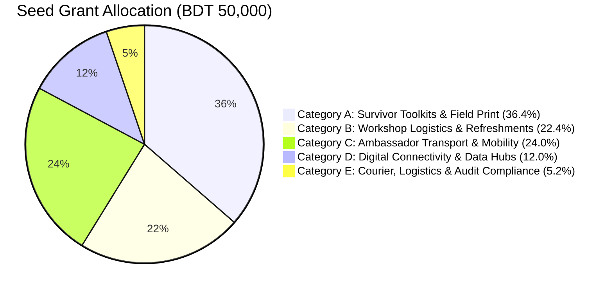

# Project Protiti (প্রতীতি) — BDT 50,000 Seed Grant Budget Allocation
**DKC Digital Respect & Cohesion Fellowship 2026 | UNDP Bangladesh, EU & SURGE**
*Grant Period: October 2026 – May 2027 (8 Months) | Total Grant Amount: BDT 50,000*

---

## 1. Compliance Statement & Financial Governance Principles

The budgeting for Project Protiti strictly adheres to the core rules of the **Digital Khichuri Challenge (DKC) Fellowship 2026**:

1. **Zero Stipend & Zero Personal Honorarium:** 100% of funds are allocated to verifiable project implementation, community workshops, offline survivor assets, and grassroots mobility. No core team members receive salaries, allowances, or administrative fees.
2. **Two-Tranche Structure:**
   * **Tranche 1 (50% / BDT 25,000):** Disbursed in October 2026 following selection and the 3-day Innovation Bootcamp to finance pilot rollout across the first four divisions (Dhaka, Chattogram, Sylhet, Rajshahi).
   * **Tranche 2 (50% / BDT 25,000):** Disbursed in January 2027 following the Midterm Progress Bootcamp review to execute rollout in the remaining four divisions (Khulna, Barishal, Rangpur, Mymensingh) and national consolidation.
3. **Extreme Fiscal Discipline & Frugality:** University venues, faculty mentorship, and pro-bono legal support (BNWLA, PCSW) are leveraged at zero financial cost, allowing every Taka to directly benefit at-risk female students and survivors.
4. **Audit Readiness (UNDP PTIB / SURGE Standards):** Every expenditure is backed by serialized money receipts, cash memos, sign-off attendance sheets with National ID/Student ID, and photographic verification of field activities.

---

## 2. High-Level Budget Summary



| Budget Category | Description | Tranche 1 (BDT) | Tranche 2 (BDT) | Total (BDT) | % of Budget |
|---|---|---|---|---|---|
| **Category A** | Survivor Toolkits & Field Print Assets | 13,000 | 5,200 | **18,200** | 36.4% |
| **Category B** | Campus & Community Workshop Logistics | 5,600 | 5,600 | **11,200** | 22.4% |
| **Category C** | Ambassador Local Transport & Grassroots Mobility | 6,000 | 6,000 | **12,000** | 24.0% |
| **Category D** | Digital Connectivity & Field Hotline SIMs | 0 | 6,000 | **6,000** | 12.0% |
| **Category E** | Inter-Divisional Courier & Audit Documentation | 400 | 2,200 | **2,600** | 5.2% |
| **TOTAL** | **Full 8-Month Implementation Lifecycle** | **25,000** | **25,000** | **50,000** | **100.0%** |

---

## 3. Granular Line-Item Cost Breakdown

### Category A: Printed Survivor Toolkits & Educational Print Assets (Total: BDT 18,200)
*Printed collateral is essential because victims in abusive households or shared dorms cannot safely keep incriminating digital search histories or heavy apps installed on open screens.*

| Line Item | Description | Unit Cost (BDT) | Units | Total (BDT) | Tranche | Rationale & Procurement Spec |
|---|---|---|---|---|---|---|
| **A.1** | **Discreet Survivor Wallet Cards (Bilingual)** | 1.30 | 10,000 cards | 13,000 | T1: 6,000<br>T2: 4,000 | 4-panel folding card (credit card size: 85mm x 54mm) on 150gsm art paper with water-resistant lamination. Designed to look like a cosmetic/loyalty card. Contains: 5 evidence preservation rules, Cyber Protection Act 2026 rights summary, emergency numbers (999, PCSW, BNWLA, Kaan Pete Roi), and offline Protiti QR code. |
| **A.2** | **Ambassador Master Training Handbooks** | 65.00 | 80 copies | 5,200 | T1: 80 | B5 spiral-bound 24-page handbook for all 64 divisional ambassadors and 16 partner desks. Contains: detailed GD filling scripts, legal clauses, evidence hashing technical manual, trauma de-escalation protocols, and safeguarding procedures. |

*Subtotal Category A:* **BDT 18,200**

---

### Category B: Campus & Community Workshop Logistics (Total: BDT 11,200)
*Workshops are hosted inside free university facilities (residential hall common rooms, student union rooms, club seminar rooms) eliminating all venue rental costs.*

| Line Item | Description | Unit Cost (BDT) | Units | Total (BDT) | Tranche | Rationale & Procurement Spec |
|---|---|---|---|---|---|---|
| **B.1** | **Workshop Refreshments (8 Divisions)** | 110.00 | 80 participants | 8,800 | T1: 40<br>T2: 40 | Modest, culturally appropriate light refreshments (packaged cake/banana/samosa + tea/bottled water) for 8 regional ambassador workshops (10 participants per workshop: 8 ambassadors + 2 regional student leaders). |
| **B.2** | **Stationery & Case Simulation Worksheets** | 300.00 | 8 divisional packs | 2,400 | T1: 4<br>T2: 4 | Flipcharts, permanent markers, blank General Diary practice forms, feedback forms, and participant name badges per divisional training hub. |

*Subtotal Category B:* **BDT 11,200**

---

### Category C: Ambassador Local Transport & Grassroots Mobility (Total: BDT 12,000)
*To ensure female student ambassadors are not personally out-of-pocket when traveling to remote upazilas, Thana cyber desks, or regional colleges.*

| Line Item | Description | Unit Cost (BDT) | Units | Total (BDT) | Tranche | Rationale & Procurement Spec |
|---|---|---|---|---|---|---|
| **C.1** | **Local Field Travel Subsidies (8 Divisions)** | 1,500.00 | 8 divisions | 12,000 | T1: 4<br>T2: 4 | Strict voucher-backed reimbursement for local rickshaw, student bus, or CNG auto-rickshaw fares for ambassadors traveling in pairs (Buddy System) to conduct dorm outreach, visit local Thana Duty Officers, or engage with BRAC community centers. BDT 1,500 per division covers ~15-20 field peer journeys. |

*Subtotal Category C:* **BDT 12,000**

---

### Category D: Digital Connectivity & Field Hotline Infrastructure (Total: BDT 6,000)
*Protects student ambassadors' privacy by ensuring they never use personal phone numbers for crisis triage or peer support.*

| Line Item | Description | Unit Cost (BDT) | Units | Total (BDT) | Tranche | Rationale & Procurement Spec |
|---|---|---|---|---|---|---|
| **D.1** | **Dedicated Project SIM Cards** | 150.00 | 8 SIMs | 1,200 | T2: 8 | Registered Teletalk/Grameenphone SIMs for 8 Divisional Lead Ambassadors to receive peer calls, route emergency escalations, and manage verified divisional Telegram broadcast groups. |
| **D.2** | **Mobile Data Packs for Offline Sync & Kiosk Hotspots** | 150.00 / month | 8 leads x 4 months | 4,800 | T2: 32 packs | 5GB high-speed monthly data packs (BDT 150/mo) enabling lead ambassadors to demonstrate app features, verify SHA-256 hash uploads, and sync offline feedback data during field outreach. |

*Subtotal Category D:* **BDT 6,000**

---

### Category E: Inter-Divisional Courier & Audit Documentation (Total: BDT 2,600)
*Ensures compliance with national financial reporting, delivery of printed assets across Bangladesh, and preparation of final showcase audit dossiers.*

| Line Item | Description | Unit Cost (BDT) | Units | Total (BDT) | Tranche | Rationale & Procurement Spec |
|---|---|---|---|---|---|---|
| **E.1** | **Regional Toolkit Courier Shipments** | 250.00 | 7 shipments | 1,750 | T1: 3<br>T2: 4 | Parcel transit fees via Sundarban Courier / SA Paribahan from the central Dhaka printing press to regional divisional university pickup points in Chattogram, Sylhet, Rajshahi, Khulna, Barishal, Rangpur, and Mymensingh. |
| **E.2** | **Audit Binders, Hardcopy Vouchers & Showcase Printouts** | 850.00 | 1 consolidated set | 850 | T2: 1 | Archival ledger folders, hardcopy printed receipt vouchers, photographic log books, and printed showcase banners required for UNDP PTIB / SURGE financial audit. |

*Subtotal Category E:* **BDT 2,600**

---

## 4. Tranche Disbursement Schedule & Cash-Flow Management

```
OCTOBER 2026                                         JANUARY 2027
┌──────────────────────────────────────────┐         ┌──────────────────────────────────────────┐
│ TRANCHE 1 DISBURSEMENT: BDT 25,000       │         │ TRANCHE 2 DISBURSEMENT: BDT 25,000       │
├──────────────────────────────────────────┤         ├──────────────────────────────────────────┤
│ • 6,000 Wallet Cards:        BDT  7,800  │         │ • 4,000 Wallet Cards:        BDT  5,200  │
│ • 80 Master Handbooks:       BDT  5,200  │         │ • Workshop Refreshments (4): BDT  4,400  │
│ • Workshop Refreshments (4): BDT  4,400  │         │ • Workshop Stationery (4):   BDT  1,200  │
│ • Workshop Stationery (4):   BDT  1,200  │         │ • Ambassador Travel (4):     BDT  6,000  │
│ • Ambassador Travel (4):     BDT  6,000  │         │ • 8 SIMs + 4-mo Data:        BDT  6,000  │
│ • T1 Regional Courier:       BDT    400  │         │ • Courier + Audit Binder:    BDT  2,200  │
├──────────────────────────────────────────┤         ├──────────────────────────────────────────┤
│ TRANCHE 1 TOTAL:             BDT 25,000  │         │ TRANCHE 2 TOTAL:             BDT 25,000  │
└──────────────────────────────────────────┘         └──────────────────────────────────────────┘
```

### Tranche 1 Liquidation Criteria (to unlock Tranche 2):
1. **Financial Vouchers:** 100% of BDT 25,000 accounted for with vendor money receipts and signed transit vouchers.
2. **Delivery Proof:** Signed delivery challans confirming 6,000 survivor cards and 80 handbooks printed and received.
3. **Training Verification:** Completed attendance records and photos for Dhaka, Chattogram, Sylhet, and Rajshahi ToT workshops.
4. **Midterm Progress Report:** Submission of the technical and field rollout report at the Progress Bootcamp (December 2026).

---

## 5. Value-for-Money & Return on Investment (ROI)

For an investment of only **BDT 50,000 ($420 USD)**, Project Protiti delivers massive grassroots dividends:

* **Cost per Direct Beneficiary Reached:**
  $$\frac{\text{BDT } 50,000}{8,000 \text{ students reached via workshops/kiosks}} = \mathbf{\text{BDT } 6.25 \text{ per student}}$$
* **Cost per High-Risk Survivor Toolkit Distributed:**
  $$\frac{\text{BDT } 18,200}{10,000 \text{ discreet wallet cards}} = \mathbf{\text{BDT } 1.82 \text{ per toolkit}}$$
* **Cost per Actionable Police Complaint Formatted:**
  $$\frac{\text{BDT } 50,000}{500 \text{ verified e-GDs/GDs generated}} = \mathbf{\text{BDT } 100.00 \text{ per court-ready case}}$$
* **Leveraged Partner Value:** Over **BDT 450,000** in pro-bono university venues, legal consultations from BNWLA, police cyber unit coordination, and UNDP mentorship mobilized through zero-cost partnerships.

---
*Prepared by Finance & Operations Desk | Project Protiti | DKC Fellowship 2026*
