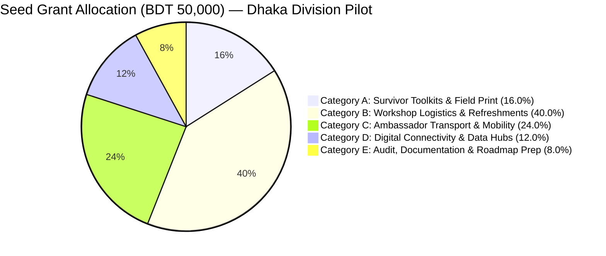

# Project Protiti (প্রতীতি) — BDT 50,000 Seed Grant Budget Allocation
**DKC Digital Respect & Cohesion Fellowship 2026 | UNDP Bangladesh, EU & SURGE**
*Grant Period: October 2026 – May 2027 (8 Months) | Total Grant Amount: BDT 50,000*

> **Grant Scope:** Per DKC Fellowship rules, each selected team is funded to implement in **one** administrative division. This BDT 50,000 seed grant is **100% concentrated on a single Home Division Pilot — Dhaka Division** (DU, JU, Eden Mohila College, BRAC University, North South University). The Protiti software, legal schema, and e-GD taxonomy are architected to scale nationally, and that national 8-division vision is documented separately in `eight_divisions_rollout.md` as the **Phase 2 Expansion Roadmap** to be pitched at the February 2027 National Showcase — it is explicitly **not** funded by this grant.

---

## 1. Compliance Statement & Financial Governance Principles

The budgeting for Project Protiti strictly adheres to the core rules of the **Digital Khichuri Challenge (DKC) Fellowship 2026**:

1. **Zero Stipend & Zero Personal Honorarium:** 100% of funds are allocated to verifiable project implementation, community workshops, offline survivor assets, and grassroots mobility. No core team members receive salaries, allowances, or administrative fees.
2. **Two-Tranche Structure (Dhaka Division Pilot Only):**
   * **Tranche 1 (50% / BDT 25,000):** Disbursed in October 2026 following selection and the 3-day Innovation Bootcamp to launch the Dhaka Division Pilot — ambassador onboarding, first toolkit print run, and the initial round of campus activations.
   * **Tranche 2 (50% / BDT 25,000):** Disbursed in January 2027 following the Midterm Progress Bootcamp review to deepen the Dhaka Division Pilot to full saturation (additional campus activations, expanded toolkit distribution, hotline infrastructure) and produce the audited impact dossier + National 8-Division Expansion Roadmap presented at the February 2027 National Showcase.
3. **Extreme Fiscal Discipline & Frugality:** University venues, faculty mentorship, and pro-bono legal support (BNWLA, PCSW) are leveraged at zero financial cost, allowing every Taka to directly benefit at-risk female students and survivors.
4. **Audit Readiness (UNDP PTIB / SURGE Standards):** Every expenditure is backed by serialized money receipts, cash memos, sign-off attendance sheets with National ID/Student ID, and photographic verification of field activities.

---

## 2. High-Level Budget Summary

*(Dhaka Division Pilot — 8 Ambassadors, 10 Campus Activations, 5,000 Survivor Toolkits)*



| Budget Category | Description | Tranche 1 (BDT) | Tranche 2 (BDT) | Total (BDT) | % of Budget |
|---|---|---|---|---|---|
| **Category A** | Survivor Toolkits & Field Print Assets | 6,500 | 1,500 | **8,000** | 16.0% |
| **Category B** | Campus & Community Workshop Logistics (10 Activations) | 10,000 | 10,000 | **20,000** | 40.0% |
| **Category C** | Ambassador Local Transport & Grassroots Mobility | 6,000 | 6,000 | **12,000** | 24.0% |
| **Category D** | Digital Connectivity & Field Hotline Infrastructure | 1,700 | 4,300 | **6,000** | 12.0% |
| **Category E** | Audit Documentation & National Roadmap Prep | 800 | 3,200 | **4,000** | 8.0% |
| **TOTAL** | **Full 8-Month Dhaka Division Pilot** | **25,000** | **25,000** | **50,000** | **100.0%** |

*Note: These same five categories previously funded a diluted 8-division rollout (BDT 6,250 per division). Concentrating the identical grant on one division multiplies real per-beneficiary spending roughly 8x — e.g., ambassador mobility support rises from ~BDT 23/ambassador-month to BDT 187.50/ambassador-month.*

---

## 3. Granular Line-Item Cost Breakdown

### Category A: Printed Survivor Toolkits & Educational Print Assets (Total: BDT 8,000)
*Printed collateral is essential because victims in abusive households or shared dorms cannot safely keep incriminating digital search histories or heavy apps installed on open screens.*

| Line Item | Description | Unit Cost (BDT) | Units | Total (BDT) | Tranche | Rationale & Procurement Spec |
|---|---|---|---|---|---|---|
| **A.1** | **Discreet Survivor Wallet Cards (Bilingual)** | 1.30 | 5,000 cards | 6,500 | T1: 5,000 | 4-panel folding card (credit card size: 85mm x 54mm) on 150gsm art paper with water-resistant lamination. Designed to look like a cosmetic/loyalty card. Contains: 5 evidence preservation rules, Cyber Protection Act 2026 rights summary, emergency numbers (999, PCSW, BNWLA, Kaan Pete Roi), and offline Protiti QR code. Distributed exclusively across Dhaka Division campuses and kiosks. |
| **A.2** | **Ambassador & Partner-Desk Training Handbooks** | 65.00 | 23 copies | 1,500 | T2: 23 | B5 spiral-bound 24-page handbook for the 8 Dhaka Division ambassadors plus 15 partner-desk copies (Thana Duty Officers, BNWLA/BLAST/PCSW liaisons). Contains: detailed GD filling scripts, legal clauses, evidence hashing technical manual, trauma de-escalation protocols, and safeguarding procedures. |

*Subtotal Category A:* **BDT 8,000**

---

### Category B: Campus & Community Workshop Logistics (Total: BDT 20,000)
*Workshops are hosted inside free university facilities (residential hall common rooms, student union rooms, club seminar rooms) eliminating all venue rental costs. Concentrating every activation in one division allows realistic per-person catering instead of splitting a handful of workshops across the whole country.*

| Line Item | Description | Unit Cost (BDT) | Units | Total (BDT) | Tranche | Rationale & Procurement Spec |
|---|---|---|---|---|---|---|
| **B.1** | **Workshop Refreshments (10 Campus Activations, Dhaka Division)** | 110.00 | 150 participant-servings | 16,500 | T1: 75<br>T2: 75 | Culturally appropriate light refreshments (samosa/cake/banana + tea/bottled water) for 10 campus activations across DU, JU, Eden Mohila College, BRACU, and NSU (15 participants per activation: 8 ambassadors + 7 student attendees/hall reps). |
| **B.2** | **Stationery, Case-Simulation Worksheets & Feedback Forms** | 250.00 | 10 packs | 2,500 | T1: 5<br>T2: 5 | Flipcharts, permanent markers, blank General Diary practice forms, feedback forms, and participant name badges per campus activation. |
| **B.3** | **Discreet Campus Kiosk Signage & Table Materials** | 100.00 | 10 sets | 1,000 | T1: 5<br>T2: 5 | Low-profile table banners and signage for "Digital Health Check" kiosks that do not visibly advertise GBV support (avoids stigma/attention). |

*Subtotal Category B:* **BDT 20,000**

---

### Category C: Ambassador Local Transport & Grassroots Mobility (Total: BDT 12,000)
*To ensure female student ambassadors are not personally out-of-pocket when traveling within Dhaka Division to visit Thana cyber desks, partner NGO offices, or other campuses.*

| Line Item | Description | Unit Cost (BDT) | Units | Total (BDT) | Tranche | Rationale & Procurement Spec |
|---|---|---|---|---|---|---|
| **C.1** | **Local Field Travel Subsidies (8 Ambassadors, Dhaka Division)** | 187.50 | 8 ambassadors × 8 months | 12,000 | T1: 6,000<br>T2: 6,000 | Strict voucher-backed reimbursement for local rickshaw, student bus, or CNG auto-rickshaw fares for ambassadors traveling in pairs (Buddy System) to conduct dorm outreach, visit local Thana Duty Officers, or engage with BRAC community centers. BDT 187.50/ambassador/month covers ~6-8 local trips. |

*Subtotal Category C:* **BDT 12,000**

---

### Category D: Digital Connectivity & Field Hotline Infrastructure (Total: BDT 6,000)
*Protects student ambassadors' privacy by ensuring they never use personal phone numbers for crisis triage or peer support.*

| Line Item | Description | Unit Cost (BDT) | Units | Total (BDT) | Tranche | Rationale & Procurement Spec |
|---|---|---|---|---|---|---|
| **D.1** | **Dedicated Project SIM Cards** | 150.00 | 3 SIMs | 450 | T1: 3 | Registered Teletalk/Grameenphone SIMs for the Dhaka Lead Ambassador, Deputy Ambassador, and shared kiosk demo line, to receive peer calls, route emergency escalations, and manage a verified Telegram broadcast group. |
| **D.2** | **Mobile Data Packs for Offline Sync & Kiosk Hotspots** | 150.00 / month | 3 lines × 8 months | 3,600 | T1: 1,250<br>T2: 2,350 | 5GB high-speed monthly data packs (BDT 150/mo) enabling lead ambassadors to demonstrate app features, verify SHA-256 hash uploads, and sync offline feedback data during field outreach. |
| **D.3** | **Portable Hotspot / Power Bank Equipment (Campus Kiosks)** | 975.00 | 2 units | 1,950 | T2: 2 | Battery-backed hotspots for live app/e-GD demos at campus kiosks where hall Wi-Fi is unreliable. |

*Subtotal Category D:* **BDT 6,000**

---

### Category E: Audit Documentation & National Roadmap Prep (Total: BDT 4,000)
*Ensures compliance with national financial reporting and prepares the Phase 2 National Expansion Roadmap dossier presented at the February 2027 National Showcase (see Grant Scope note above — Phase 2 itself is unfunded by this grant).*

| Line Item | Description | Unit Cost (BDT) | Units | Total (BDT) | Tranche | Rationale & Procurement Spec |
|---|---|---|---|---|---|---|
| **E.1** | **Local Courier & Field Logistics (Dhaka Division only)** | — | 1 set | 800 | T1: 800 | Intra-city parcel/courier fees between the Dhaka printing vendor and campus pickup points. No inter-divisional shipping required. |
| **E.2** | **Audit Binders, Hardcopy Vouchers & Showcase Printouts** | 1,200.00 | 1 consolidated set | 1,200 | T2: 1,200 | Archival ledger folders, hardcopy printed receipt vouchers, photographic log books, and printed showcase banners required for UNDP PTIB / SURGE financial audit. |
| **E.3** | **National 8-Division Expansion Roadmap Dossier** | 2,000.00 | 1 dossier | 2,000 | T2: 2,000 | Professionally formatted printed + digital dossier presenting the Dhaka Pilot's audited results and the software/legal architecture's national scalability (see `eight_divisions_rollout.md`), for the February 2027 National Showcase. This is a documentation deliverable only — it does not fund Phase 2 field activity. |

*Subtotal Category E:* **BDT 4,000**

---

## 4. Tranche Disbursement Schedule & Cash-Flow Management

```
OCTOBER 2026                                         JANUARY 2027
┌──────────────────────────────────────────┐         ┌──────────────────────────────────────────┐
│ TRANCHE 1 DISBURSEMENT: BDT 25,000       │         │ TRANCHE 2 DISBURSEMENT: BDT 25,000       │
├──────────────────────────────────────────┤         ├──────────────────────────────────────────┤
│ • 5,000 Wallet Cards:        BDT  6,500  │         │ • 23 Ambassador Handbooks:   BDT  1,500  │
│ • Workshop Refreshments (5): BDT  8,250  │         │ • Workshop Refreshments (5): BDT  8,250  │
│ • Workshop Stationery (5):   BDT  1,250  │         │ • Workshop Stationery (5):   BDT  1,250  │
│ • Kiosk Signage (5):         BDT    500  │         │ • Kiosk Signage (5):         BDT    500  │
│ • Ambassador Travel (4 mo):  BDT  6,000  │         │ • Ambassador Travel (4 mo):  BDT  6,000  │
│ • 3 SIMs + Data (T1 share):  BDT  1,700  │         │ • Data (T2 share) + Hotspots:BDT  4,300  │
│ • Local Courier:             BDT    800  │         │ • Audit Binder + Roadmap:    BDT  3,200  │
├──────────────────────────────────────────┤         ├──────────────────────────────────────────┤
│ TRANCHE 1 TOTAL:             BDT 25,000  │         │ TRANCHE 2 TOTAL:             BDT 25,000  │
└──────────────────────────────────────────┘         └──────────────────────────────────────────┘
```

### Tranche 1 Liquidation Criteria (to unlock Tranche 2):
1. **Financial Vouchers:** 100% of BDT 25,000 accounted for with vendor money receipts and signed transit vouchers.
2. **Delivery Proof:** Signed delivery challans confirming 5,000 survivor cards printed and received.
3. **Training Verification:** Completed attendance records and photos for 5 Dhaka Division campus activations (DU, JU, Eden Mohila College, BRACU, NSU).
4. **Midterm Progress Report:** Submission of the technical and field rollout report at the Progress Bootcamp (December 2026).

---

## 5. Value-for-Money & Return on Investment (ROI)

For an investment of only **BDT 50,000 ($420 USD)**, concentrated entirely on the Dhaka Division Pilot, Project Protiti delivers deep, verifiable grassroots dividends:

* **Cost per Direct Beneficiary Reached:**
  $$\frac{\text{BDT } 50,000}{3,000 \text{ students reached via 10 campus activations/kiosks}} = \mathbf{\text{BDT } 16.67 \text{ per student}}$$
* **Cost per High-Risk Survivor Toolkit Distributed:**
  $$\frac{\text{BDT } 8,000}{5,000 \text{ discreet wallet cards}} = \mathbf{\text{BDT } 1.60 \text{ per toolkit}}$$
* **Cost per Actionable Police Complaint Formatted:**
  $$\frac{\text{BDT } 50,000}{120 \text{ verified e-GDs/GDs generated}} = \mathbf{\text{BDT } 416.67 \text{ per court-ready case}}$$
* **Leveraged Partner Value:** Over **BDT 150,000** in pro-bono Dhaka university venues (DU, JU, Eden Mohila College, BRACU, NSU), legal consultations from BNWLA, PCSW coordination, and UNDP mentorship mobilized through zero-cost partnerships within the single pilot division.

*These figures describe the Dhaka Division Pilot only. National-scale projections (8 divisions, 64 ambassadors, 8,000+ reach) are Phase 2 illustrative targets contingent on additional post-fellowship funding — see `eight_divisions_rollout.md`.*

---
*Prepared by Finance & Operations Desk | Project Protiti | DKC Fellowship 2026*
