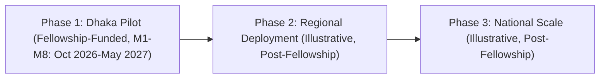
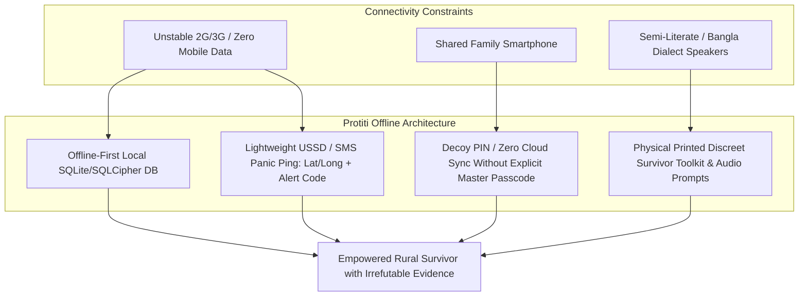

# Project Protiti (প্রতীতি) — National Architecture & Phase 2 Expansion Roadmap
**DKC Digital Respect & Cohesion Fellowship 2026 | UNDP Bangladesh & SURGE**
*Theme: Gender-Based Online Violence | Cross-Cutting Lens: Gender Equity & Youth Empowerment*

> **Grant Scope Clarification:** Per DKC Fellowship rules, each selected team implements in **one** administrative division. The BDT 50,000 seed grant funds a concentrated **Dhaka Division Pilot only** — 8 Ambassadors, 10 campus activations, 5,000 survivor toolkits (full detail in `budget_50k.md`). Everything in **this** document — the 8-division rollout, 64-ambassador network, and divisional profiles below — is the **Phase 2 National Expansion Roadmap**: illustrative evidence that the Protiti software, legal schema, and e-GD taxonomy are architected to scale nationally, to be pitched at the February 2027 National Showcase and pursued through separate post-fellowship partnerships/funding. It is **not** funded by the current BDT 50,000 grant, and no divisional activity described below occurs during the 8-month fellowship period unless explicitly marked "Dhaka Division Pilot."

---

## Executive Summary & Strategic Approach

Online gender-based violence (OGBV) in Bangladesh is not uniform: the digital threats faced by a female student in Dhaka's university dormitories differ fundamentally from those faced by an indigenous youth in the Chittagong Hill Tracts or an artisan woman in rural Barishal. Project Protiti's architecture is designed to bridge this divide nationally through a hyper-localized, decentralised campus-to-community model — **once it expands beyond the current fellowship-funded pilot.**

The **fellowship-funded Dhaka Division Pilot (October 2026 – May 2027, BDT 50,000)** deploys **8 trained Female Campus Ambassadors** across Dhaka Division's university campuses. The Phase 2 vision illustrated in this document — a cadre of **64 trained Female Campus & Community Ambassadors (8 per division)** across all 8 administrative divisions of Bangladesh — is the national scale-up target for the period **after** the fellowship, pending additional funding/partnership secured at the February 2027 National Showcase. The strategy pairs mobile evidence vault dissemination with physical survivor toolkits, local police *Thana* engagement, and strategic NGO partnerships (BRAC, BNWLA, BLAST, PCSW).

```mermaid
flowchart TD
    subgraph National Core
        DKC[UNDP DKC / SURGE Mentorship] --> Core[Protiti Core Team (5 Members)]
        Core --> Advisory[Legal & Psychosocial Advisory (BNWLA, PCSW, Kaan Pete Roi)]
    end

    subgraph 8 Divisional Hubs
        Core --> DH1[Dhaka Hub: DU / JU / BRACU]
        Core --> DH2[Chattogram Hub: CU / AUW / CHT]
        Core --> DH3[Sylhet Hub: SUST / SAU]
        Core --> DH4[Rajshahi Hub: RU / RUET]
        Core --> DH5[Khulna Hub: KU / JUST]
        Core --> DH6[Barishal Hub: BU / BM College]
        Core --> DH7[Rangpur Hub: BRUR / HSTU]
        Core --> DH8[Mymensingh Hub: BAU / JKKNIU]
    end

    subgraph Grassroots Micro-Ecosystem (Per Division)
        DH1 --> Amb[8 Trained Campus Ambassadors]
        Amb --> Kiosks[Discreet Campus Kiosks & Hall Circles]
        Amb --> Thana[Local Thana Duty Officers & Cyber Desks]
        Amb --> UDC[Union Digital Centres & Community Hubs via BRAC]
        Amb --> Peer[Direct Peer Support & Toolkit Distribution]
    end
```

---

## 1a. Fellowship-Funded Dhaka Division Pilot Timeline (Actual — BDT 50,000)

This is what the current BDT 50,000 seed grant actually funds, month by month. All activity below is confined to Dhaka Division.

| Fellowship Month | Calendar Period | Milestone Focus | Dhaka Division Activity & Key Outputs |
|---|---|---|---|
| **Month 1** | October 2026 | **Innovation Bootcamp & Pilot Co-Design** | • Attend 3-day residential Innovation Bootcamp in Dhaka.<br>• Refine App v1.0 (Cyber Protection Act 2026 mapping, Duress PIN, e-GD draft).<br>• Pilot launch in Dhaka Division (DU, JU, Eden Mohila College).<br>• Disburse Seed Grant Tranche 1 (BDT 25,000). |
| **Month 2** | November 2026 | **Dhaka Ambassador Onboarding & First Activations** | • Dhaka Ambassador Cohort (8 fellows) onboarded & certified.<br>• Print 1st run of 5,000 discreet survivor toolkits (wallet cards).<br>• First 2-3 campus activations (DU, JU, Eden Mohila College). |
| **Month 3** | December 2026 | **Progress Bootcamp & Deepening Dhaka Engagement** | • Attend 2-day residential Progress Bootcamp.<br>• Expand campus activations to BRACU and NSU.<br>• Conduct formal liaison with Police Cyber Support for Women (PCSW) & Dhaka Met Police. |
| **Month 4** | January 2027 | **Dhaka Pilot Saturation** | • Remaining campus activations (10 total across the 5 Dhaka campuses).<br>• Midterm implementation review; Seed Grant Tranche 2 (BDT 25,000) disbursement. |
| **Month 5** | February 2027 | **National Showcase** | • **DKC National Showcase Event (February 2027)** — present audited Dhaka Division Pilot results and the Phase 2 National Expansion Roadmap (Section 2 below) to UNDP/EU. |
| **Month 6** | March 2027 | **Dhaka Consolidation** | • Consolidate Dhaka bug fixes, legal template updates, and e-GD submissions.<br>• Prepare open-source release plan for the Legal Logic Engine. |
| **Month 7** | April 2027 | **Institutional Handover & Sustainability** | • DU/JU/Eden Mohila College/BRACU/NSU Proctor & Student Affairs office institutionalization.<br>• Connect campus anti-harassment cells directly to Protiti app resource channels.<br>• Joint audit with BNWLA and BLAST on Dhaka Division case resolution and GD acceptance rates. |
| **Month 8** | May 2027 | **Fellowship Consolidation & Open Source Release** | • Final impact evaluation report submitted to SURGE / UNDP PTIB.<br>• Protiti Legal Logic Engine released as open-source public good.<br>• Ambassadors transition to lifelong DKC Alumni Peacebuilding Network; pursue Phase 2 partnerships for national expansion. |

---

## 1b. Phase 2: Illustrative National Expansion Timeline (Post-Fellowship, Indicative — Not Funded by This Grant)

The timeline below illustrates how Protiti's architecture *could* scale nationally in the 8 months following the fellowship (tentatively June 2027 – January 2028), contingent on securing separate funding or institutional partnership at the February 2027 National Showcase. It is presented to demonstrate technical and operational scalability, not as a fellowship deliverable.



| Illustrative Month | Milestone Focus | Divisional Activity & Key Outputs |
|---|---|---|
| **Month 1-2** | **Eastern Corridor: Chattogram & Sylhet** | • Onboard Chattogram (CU, AUW) and Sylhet (SUST, MC College) ambassadors.<br>• Roll out dialect-adapted toolkits (Chittagonian and Sylheti glossaries).<br>• Initiate CHT ethnic minority student outreach in Chattogram. |
| **Month 3-4** | **Northern Corridor: Rajshahi & Rangpur** | • Onboard Rajshahi (RU, RUET) and Rangpur (BRUR, HSTU) ambassadors.<br>• Off-campus student housing ("Mess") safety campaign against non-consensual filming. |
| **Month 5-6** | **Southern Belt: Khulna & Barishal** | • Onboard Khulna (KU, JUST) and Barishal (BU, BM College) ambassadors.<br>• Rural/coastal offline workshops via BRAC Community Centres and Union Digital Centres (UDCs). |
| **Month 7-8** | **Central North: Mymensingh & National Ring** | • Onboard Mymensingh (BAU, JKKNIU) ambassadors.<br>• Indigenous Garo youth outreach in Netrokona/Sherpur border areas.<br>• Consolidate 8-division bug fixes, legal template updates, and e-GD submissions. |

---

## 2. Division-by-Division Operational Profiles (Phase 2 — Illustrative, Post-Fellowship)

*These profiles describe the Phase 2 National Expansion targets, not current fellowship activity. Only the Dhaka profile below reflects work funded by the BDT 50,000 seed grant; the remaining 7 profiles are included to demonstrate that Protiti's operational model has been researched and designed to scale nationally.*

Each division possesses distinct socio-technological vulnerabilities, key institutional anchors, target Thanas, and community partners:

### Division 1: Dhaka (Urban Density & Academic Hub)
* **Vulnerability Profile:** Highest concentration of cyber harassment cases in Bangladesh: dorm-room video leaks, fake social media profiles, non-consensual deepfakes, blackmail targeting young working women and university students.
* **Lead University Campuses:**
  * University of Dhaka (DU) — *Rokeya Hall, Shamsun Nahar Hall, Kabi Sufia Kamal Hall*
  * Jahangirnagar University (JU) — *Pritilata Hall, Jahanara Imam Hall*
  * Eden Mohila College (Azimpur) & Begum Badrunnesa Govt. Girls College
  * BRAC University (Merul Badda) & North South University (Bashundhara R/A)
* **Priority Thanas & Police Cyber Cells:**
  * Shahbagh Thana & Dhanmondi Thana (High student complaint volume)
  * Badda & Bhatara Thana (Private university belt)
  * CID Cyber Police Centre (Mali Bagh HQ) & PCSW Headquarters (Dhaka Metro)
* **Community Hubs & Partner Touchpoints:**
  * BRAC Centre (Mohakhali) Gender Justice & Diversity Hub
  * Drik Gallery / Chhobir Haat youth discussion spaces
  * Nilkhet Student Welfare Libraries & Hall Common Rooms
* **Ambassador Deployment:** 8 Ambassadors (4 Public University, 2 Private University, 2 National College affiliates).

### Division 2: Chattogram (Port Metro, Commercial & Ethnic Minority Inclusion)
* **Vulnerability Profile:** Intersecting urban cyber extortion in commercial sectors, coastal vulnerabilities, and targeted harassment of indigenous female students from the Chittagong Hill Tracts (CHT: Chakma, Marma, Tripura communities).
* **Lead University Campuses:**
  * University of Chittagong (CU - Hathazari campus & shuttle train network)
  * Asian University for Women (AUW - regional/international student community)
  * Chittagong University of Engineering and Technology (CUET)
  * Chittagong College & Govt. Hazi Muhammad Mohsin College
* **Priority Thanas & Police Cyber Cells:**
  * Hathazari Model Thana (CU jurisdiction)
  * Kotwali Thana & Panchlaish Thana (Chattogram City Core)
  * Rangamati Sadar Thana & Bandarban Sadar Thana (CHT liaison)
* **Community Hubs & Partner Touchpoints:**
  * CHT Indigenous Women's Network (Hill Women's Federation contacts)
  * Shishu Academy Chattogram youth forums
  * Agrabad Commercial Community Centers
* **Ambassador Deployment:** 8 Ambassadors (including 2 Indigenous/CHT student leaders, 4 CU, 2 AUW/Chittagong College).

### Division 3: Sylhet (Diaspora Dynamics & Conservative Enclaves)
* **Vulnerability Profile:** Transnational cyber harassment: overseas relatives/ex-partners weaponizing leaked photos; conservative social stigmatization leading to extreme reluctance to visit physical Thanas; Facebook group defamation.
* **Lead University Campuses:**
  * Shahjalal University of Science and Technology (SUST - Kumargaon)
  * Sylhet Agricultural University (SAU)
  * Murari Chand (MC) College & Sylhet Women's Medical College
  * Leading University (Ragibnagar)
* **Priority Thanas & Police Cyber Cells:**
  * Jalalabad Thana (SUST jurisdiction)
  * Kotwali Model Thana Sylhet (Zindabazar/Bandar corridor)
  * Beanibazar Thana & Habiganj Sadar Thana (Expatriate belt)
* **Community Hubs & Partner Touchpoints:**
  * Kendriya Muslim Sahitya Sangsad youth literary circles
  * Tea garden community worker collectives (peri-urban outreach via local NGOs)
  * SUST Central Library discreet support desks
* **Ambassador Deployment:** 8 Ambassadors (4 SUST, 2 MC College, 2 Peri-urban/District representatives).

### Division 4: Rajshahi (Student Town "Mess" Culture & Legal Aid Desert)
* **Vulnerability Profile:** High concentration of female students living in unmonitored private student boarding houses ("Mess") across Motihar and Boalia; widespread hidden camera threats and blackmail; low cyber litigation literacy.
* **Lead University Campuses:**
  * University of Rajshahi (RU - Motihar)
  * Rajshahi University of Engineering & Technology (RUET)
  * Rajshahi College (largest National University college in North Bengal)
  * Begum Rokeya Govt. Girls College
* **Priority Thanas & Police Cyber Cells:**
  * Motihar Thana (RU campus and residential student enclave)
  * Boalia Model Thana (Rajshahi town centre)
  * Paba Thana & Godagari Thana
* **Community Hubs & Partner Touchpoints:**
  * Rajshahi Association Library & Padma River Embankment student collectives
  * Local BLAST (Bangladesh Legal Aid and Services Trust) Rajshahi Clinic
  * RU Shaheed Minar open-air student forums
* **Ambassador Deployment:** 8 Ambassadors (4 RU, 2 RUET, 2 Rajshahi College).

### Division 5: Khulna (Peri-Urban Coastal Belt & Cross-Border Scams)
* **Vulnerability Profile:** Trafficking-adjacent online exploitation; fake romance scams; WhatsApp sextortion; low digital literacy among college-going young women in peripheral upazilas.
* **Lead University Campuses:**
  * Khulna University (KU - Gollamari)
  * Khulna University of Engineering & Technology (KUET)
  * Government Brajalal (BL) College (Daulatpur)
  * Jashore University of Science and Technology (JUST)
* **Priority Thanas & Police Cyber Cells:**
  * Harintana Thana (KU jurisdiction)
  * Khalishpur Thana & Daulatpur Thana (BL College zone)
  * Kotwali Model Thana, Jashore
* **Community Hubs & Partner Touchpoints:**
  * Union Digital Centres (UDCs) in Batiaghata and Rupsha
  * Rupantar (Local youth and gender rights NGO) community halls
  * Khulna Press Club youth dialogue spaces
* **Ambassador Deployment:** 8 Ambassadors (3 KU, 2 BL College, 2 JUST, 1 Coastal/Upazila youth worker).

### Division 6: Barishal (Riverine Geography & Digital Connectivity Gaps)
* **Vulnerability Profile:** Geographic isolation; patchy 3G/4G connectivity along river channels; harassment via IMO and WhatsApp with high rates of victim shaming; extreme lack of female-friendly legal consultation in upazilas.
* **Lead University Campuses:**
  * University of Barishal (BU - Karnakathi)
  * Govt. Brojomohun (BM) College (historic campus with over 30,000 students)
  * Patuakhali Science and Technology University (PSTU - Dumki)
  * Barishal Govt. Women's College
* **Priority Thanas & Police Cyber Cells:**
  * Bandar Thana (BU jurisdiction across the Kirtankhola River)
  * Kotwali Model Thana Barishal
  * Bakerganj Thana & Bhola Sadar Thana
* **Community Hubs & Partner Touchpoints:**
  * BM College Central Common Room & Student Canteen
  * Launch Terminal youth volunteer desks (Barishal River Port)
  * BRAC Barishal Regional Office training rooms
* **Ambassador Deployment:** 8 Ambassadors (3 BU, 3 BM College, 2 PSTU/Govt Women's College).

### Division 7: Rangpur (Agrarian North, Child Marriage & Social Stigma)
* **Vulnerability Profile:** Conservative social dynamics; threats of forced marriage triggered by cyber blackmail; Facebook impersonation accounts targeting high school and college girls; Santal indigenous youth marginalization in Dinajpur.
* **Lead University Campuses:**
  * Begum Rokeya University, Rangpur (BRUR)
  * Carmichael College (historic multi-faculty campus)
  * Hajee Mohammad Danesh Science & Technology University (HSTU - Dinajpur)
  * Rangpur Govt. College
* **Priority Thanas & Police Cyber Cells:**
  * Tajhat Thana (BRUR and Carmichael College area)
  * Kotwali Thana Rangpur
  * Dinajpur Sadar Thana & Kurigram Sadar Thana
* **Community Hubs & Partner Touchpoints:**
  * Rangpur Sahitya Parishad Hall
  * Dinajpur Adivasi Youth Council offices
  * Upazila Youth Development Centres (Kurigram and Lalmonirhat)
* **Ambassador Deployment:** 8 Ambassadors (3 BRUR, 3 Carmichael College, 2 HSTU/Dinajpur indigenous youth).

### Division 8: Mymensingh (Garoland Border, Agricultural & Cultural Hub)
* **Vulnerability Profile:** Rapid internet penetration without matching digital safety education; indigenous Garo women in Haluaghat and Netrokona targeted on social platforms; student harassment across vast rural campus layouts.
* **Lead University Campuses:**
  * Bangladesh Agricultural University (BAU)
  * Jatiya Kabi Kazi Nazrul Islam University (JKKNIU - Trishal)
  * Mymensingh Medical College & Ananda Mohan College
* **Priority Thanas & Police Cyber Cells:**
  * Kotwali Model Thana Mymensingh
  * Trishal Thana (JKKNIU jurisdiction)
  * Haluaghat Thana & Netrokona Sadar Thana
* **Community Hubs & Partner Touchpoints:**
  * BAU Female Halls (Sultana Razia Hall, Begum Rokeya Hall)
  * Achim Patgari indigenous community welfare spaces (Garo youth network)
  * Ananda Mohan College auditorium and youth study clubs
* **Ambassador Deployment:** 8 Ambassadors (3 BAU, 3 JKKNIU, 2 Ananda Mohan College/Garo community).

---

## 3. Train-the-Trainer (ToT) Campus Ambassador Syllabus

The 8 Dhaka Division Pilot Ambassadors (fellowship-funded) undergo a rigorous, accredited **2-Day Hybrid Intensive Curriculum** combining legal fluency, app navigation, trauma de-escalation, and safeguarding. The same curriculum is designed to scale to the full 64-Ambassador national cohort in Phase 2.

```
┌────────────────────────────────────────────────────────────────────────┐
│                   TRAIN-THE-TRAINER (ToT) SYLLABUS                    │
├───────────────────────────────────┬────────────────────────────────────┤
│ DAY 1: LAW, TECH & CERTITUDE      │ DAY 2: PEER SUPPORT & SAFEGUARDING │
├───────────────────────────────────┼────────────────────────────────────┤
│ 09:00 - 10:30 Legal Landscape     │ 09:00 - 10:30 Trauma-Informed      │
│ (Cyber Protection Act 2026, PCA)  │ Communication & Active Listening   │
│ 10:45 - 12:45 Evidence Mastery    │ 10:45 - 12:45 Roleplay & Crisis    │
│ (SHA-256 Hashing, Metadata, Vault)│ Escalation (PCSW, 999, Kaan Pete)  │
│ 13:45 - 15:30 GD Automator &      │ 13:45 - 15:30 Community Workshops │
│ e-GD Integration (Police station) │ & Campus Kiosk Simulation          │
│ 15:45 - 17:00 Duress PIN &        │ 15:45 - 17:00 Ambassador Safety,   │
│ Shared Device Architecture        │ Code of Conduct & Certification    │
└───────────────────────────────────┴────────────────────────────────────┘
```

### Day 1: Legal Frameworks, Evidence Vault Architecture & Law Enforcement
* **Module 1.1 (09:00 – 10:30): The Cyber Protection Act 2026 & Bangladesh Legal Code**
  * *Content:* Demystifying the transition from DSA 2018 / CSA 2023 to the **Cyber Protection Act 2026**. Specific sections criminalizing revenge porn, sextortion, AI-generated deepfakes, and non-consensual image sharing. Concurrency with the Pornography Control Act 2012.
  * *Practical Outcome:* Ambassadors learn the precise legal terminology needed to frame an actionable complaint without exposing the victim to counter-charges.
* **Module 1.2 (10:45 – 12:45): Technical Forensics & Protiti Evidence Vault**
  * *Content:* Why screenshots fail in court (EXIF stripping, lack of server-side timestamps). How Protiti calculates SHA-256 cryptographic hashes locally, captures raw payloads, and secures files with AES-256 encryption.
  * *Hands-on Lab:* Simulating evidence capture from Facebook Messenger, WhatsApp, and Telegram; verifying hash integrity.
* **Module 1.3 (13:45 – 15:30): The GD-Automator & e-GD Portal (`gd.police.gov.bd`)**
  * *Content:* Step-by-step walkthrough of the General Diary (GD) generation wizard. Formatting requirements for local Thanas vs. the online e-GD portal. Navigating the localized Thana directory across all 64 districts.
  * *Hands-on Lab:* Drafting mock GDs in Bengali and English for 3 standard cases (impersonation, blackmail, stalker threat).
* **Module 1.4 (15:45 – 17:00): Shared Device Realities & Counter-Surveillance**
  * *Content:* Threat modeling in multi-user and hostile domestic environments. Using the Duress PIN / Decoy Calculator mode; "shake-to-hide" sensor triggers; cache wiping; emergency offline PWA access.

### Day 2: Trauma-Informed Peer Support, Triage & Field Safeguarding
* **Module 2.1 (09:00 – 10:30): Trauma-Informed First Response**
  * *Content:* Psychological first aid for cyber harassment victims. De-escalating panic, removing victim-blaming language, validating feelings while establishing emotional boundaries.
  * *Guest Facilitator:* Clinical psychologist / counselor from Kaan Pete Roi (Bangladesh's emotional support helpline).
* **Module 2.2 (10:45 – 12:45): Crisis Triage & Referral Escalation Matrix**
  * *Content:* Setting firm boundaries: Ambassadors are **facilitators**, not lawyers, police officers, or therapists.
  * *The Escalation Protocol:*
    * Immediate physical danger / Suicide threat ➔ Dial **999** / Kaan Pete Roi.
    * Severe extortion / Ongoing blackmail ➔ PCSW Hotline (**01320000888**) & CID Cyber Unit.
    * Formal litigation / Court representation ➔ BNWLA & BLAST pro-bono panels.
* **Module 2.3 (13:45 – 15:30): Conducting Safe Campus Kiosks & Dormitory Circles**
  * *Content:* Organizing low-profile, high-impact "Digital Health Check" tables in residential hall common rooms, university cafeterias, and youth clubs. Discreetly distributing printed toolkits without attracting hostile attention from partisan student factions or campus bullies.
* **Module 2.4 (15:45 – 17:00): Ambassador Safeguarding, Code of Conduct & Certification**
  * *Content:* Review of the strict Ambassador Safeguarding Protocol, non-disclosure agreements, anonymity safeguards, and emergency buddy systems. Issuance of joint DKC / SURGE / Protiti Trainer Credentials.

---

## 4. Multi-Sector Strategic Partnerships

Project Protiti does not operate in an institutional silo. We formally integrate with existing national law enforcement, legal aid, grassroots NGO, and psychosocial infrastructure:

| Partner Organization | Institutional Role | Operational Touchpoint in Protiti | Formalization Mechanism |
|---|---|---|---|
| **Police Cyber Support for Women (PCSW)** | Official law enforcement integration & urgent intervention | Dedicated hotlink to PCSW hotline (**01320000888**), direct transfer of certified GD drafts to designated female police cyber officers | Letter of Collaboration via DKC Fellowship / Ministry of Home Affairs Cyber Wing |
| **Bangladesh National Woman Lawyer's Association (BNWLA)** | Pro-bono legal counsel & court representation | Referral bridge in the app; legal verification of automated GD templates to guarantee admissibility under the Cyber Protection Act 2026 | MOU signed during Month 2 of Fellowship |
| **Bangladesh Legal Aid and Services Trust (BLAST)** | District-level legal aid clinics across all 8 divisions | Referral pathways for marginalized, rural, and indigenous women needing physical court support outside Dhaka | Partnership protocol via BLAST District Clinics in 8 divisional cities |
| **Cyber Crime Awareness Foundation (CCA Foundation)** | Research, trend analysis & digital literacy co-hosting | Co-branding on the printed Survivor Toolkits; joint cyber threat advisories for emerging scams and AI deepfakes | Knowledge Partnership Agreement |
| **BRAC Gender Justice & Diversity Programme** | Grassroots rural & peri-urban reach | Utilization of BRAC Community Empowerment Clubs and Union Digital Centres (UDCs) in Barishal, Khulna, and Rangpur | DKC Community Network Alignment (UNDP / BRAC ecosystem) |
| **Kaan Pete Roi (Emotional Support Helpline)** | Psychosocial and mental health support | In-app confidential crisis routing for survivors suffering from severe depression or suicidal ideation | Direct referral integration & ambassador mental health debriefings |

---

## 5. Offline & Rural Penetration: Overcoming the Digital Divide

A critical critique of tech initiatives in Bangladesh is the urban-elite bias: apps fail when devices are shared, internet is intermittent, or users are semi-literate. Protiti incorporates 4 specific mechanisms for rural and offline accessibility:



1. **Lightweight USSD / SMS Fallback for Panic Alert:**
   * When data is unavailable, the emergency panic mechanism automatically compresses alert coordinates into a single 160-character cellular SMS containing: GPS coordinates, timestamp, and battery level sent to 3 pre-selected emergency contacts. It does not attempt to blast heavy media over dead data networks.
2. **Offline-First Vault & Template Generation:**
   * All evidence hashing (SHA-256) and GD document formatting occurs completely client-side in the local SQLite/SQLCipher database. The app requires zero bytes of internet traffic to compile and lock a legally formatted complaint.
3. **Discreet Printed Survivor Toolkits (Wallet Cards & Foldouts):**
   * High-quality, durable, pocket-sized folding cards designed to resemble an ATM slip or a cosmetics promotional card. Contains:
     * Emergency numbers (999, 109, 01320000888, Kaan Pete Roi).
     * 5-step evidence preservation rules (What to screenshot, what NOT to delete).
     * Legal rights summary in conversational Bangla under the Cyber Protection Act 2026.
     * QR code + discreet short-link to download the Protiti offline APK.
4. **Union Digital Centre (UDC) Kiosk Integration:**
   * Partnering with female UDC entrepreneurs across peri-urban Thanas to act as discreet physical download and printing points for GD templates for women who do not own personal smartphones.

---

## 6. Comprehensive Monitoring, Evaluation & Impact KPIs

Success is measured through rigorous quantitative metrics and qualitative verification. The **Fellowship Target** column is what the BDT 50,000 grant is actually accountable for (Dhaka Division Pilot only); the **Phase 2 Illustrative Target** column shows what the same model would deliver at full 8-division national scale, contingent on post-fellowship funding.

| Category | Fellowship Target (Dhaka Pilot, BDT 50K) | Phase 2 Illustrative Target (National, Post-Fellowship) | Measurement Frequency | Verification Method |
|---|---|---|---|---|
| **Ambassador Network** | 8 Fully Certified Female Ambassadors (Dhaka Division) | 64 Ambassadors across 8 Divisions (8 per division) | Month 2, 4, 6 | Training logs, attendance records, practical exam scores |
| **Direct Peer Outreach** | 3,000+ Female University & College Students reached via 10 campus activations & kiosks | 8,000+ Students reached nationally | Bi-weekly | Workshop attendance slips, campus kiosk registration tally |
| **Survivor Toolkits Distributed** | 5,000 Physical discreet wallet cards disseminated in Dhaka Division | 12,000 Cards & offline guides disseminated nationally | Monthly | Inventory distribution logs |
| **App Installations & Vault Security** | 1,000+ Secure Vaults activated; 0 security leaks | 3,500+ Secure Vaults activated nationally; 0 security leaks | Monthly | Client-side anonymized telemetry (privacy-preserving counter) |
| **Actionable Complaints Filed** | 120+ Structurally sound GDs / e-GDs generated with cryptographic metadata | 500+ Nationally | Bi-monthly | Anonymized user survey & partner legal aid desk intake records |
| **Law Enforcement Acceptance** | >85% GD acceptance rate at Dhaka target Thanas without rejection for formatting | >85% Nationally | Quarterly | Partner liaison reports (BNWLA & PCSW feedback loop) |
| **Crisis Escalations** | 100% of severe threats connected to PCSW / BNWLA / 999 within 15 minutes | 100% Nationally | Real-time | Emergency referral log (Support Bridge desk) |
| **Ambassador Safeguarding** | 0 Safety breaches, zero student doxxing, zero unaddressed trauma cases | 0 Nationally | Ongoing / Weekly | Weekly check-in logs with Mental Health Officer |

---
*Authored by Project Protiti Community & Outreach Team | DKC Digital Respect & Cohesion Fellowship 2026*
