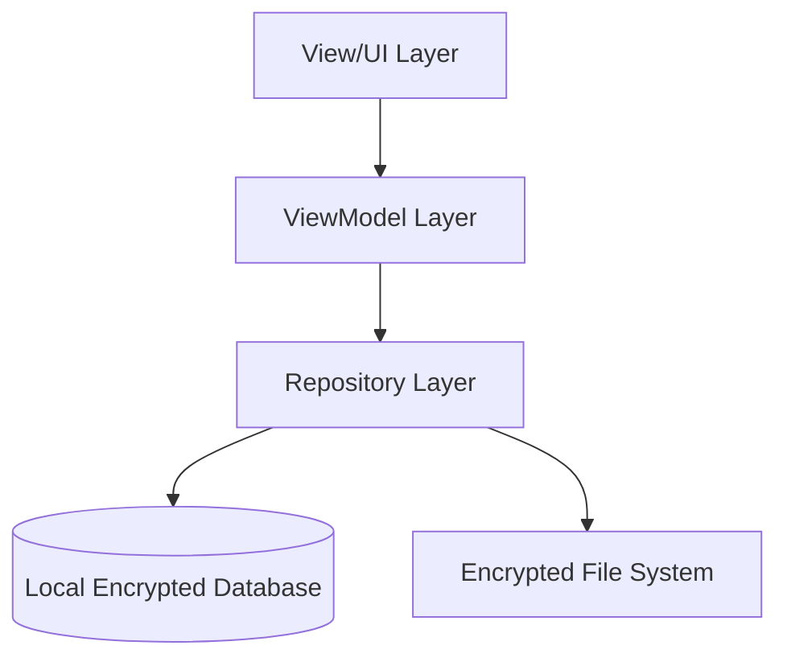
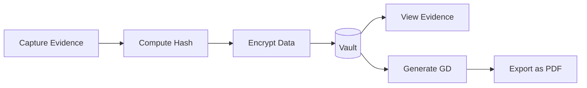
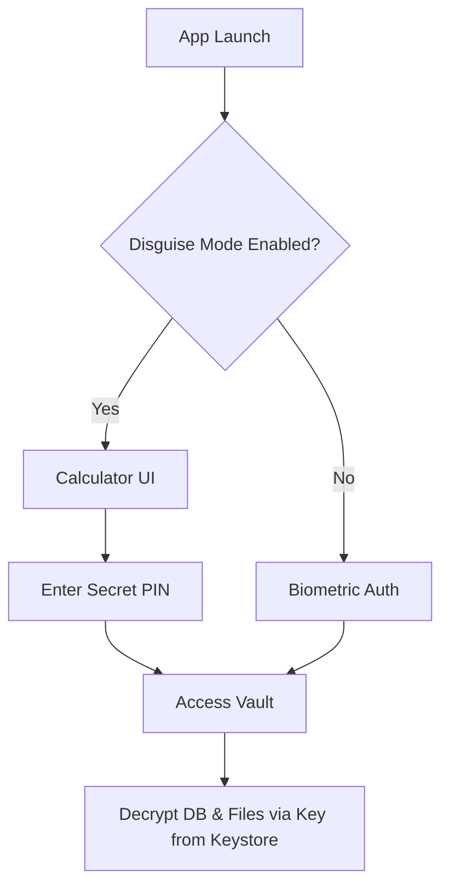
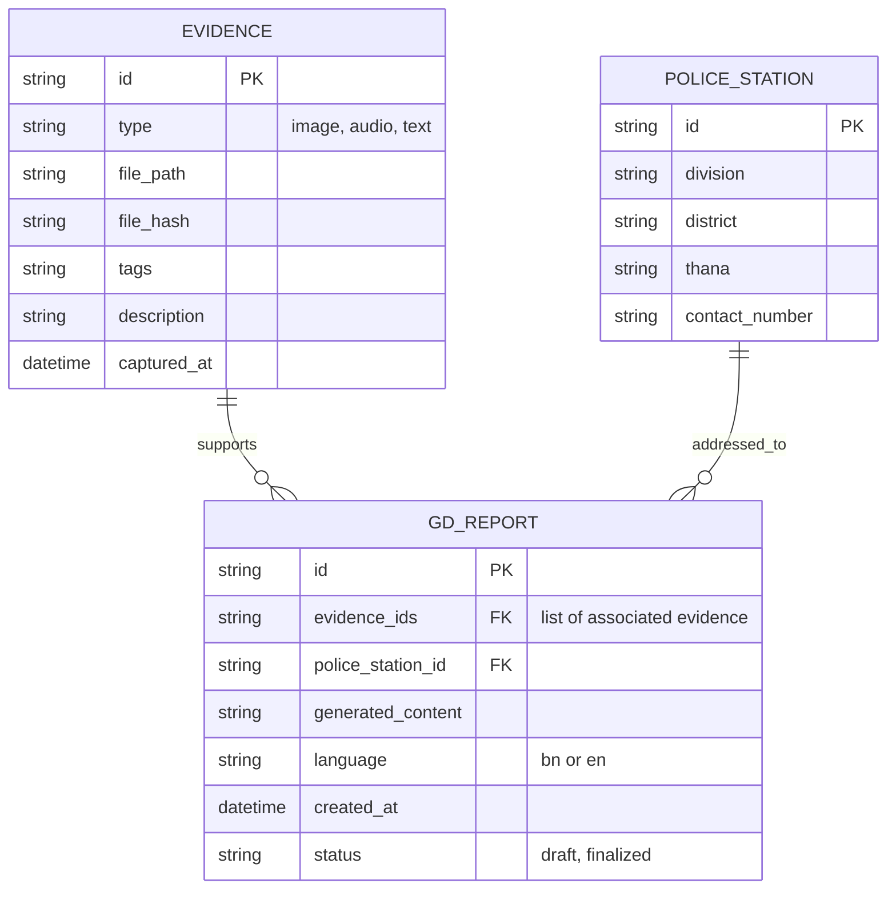

# Protiti (প্রতীতি): Digital Evidence Vault - Project Plan

## 1. Project Overview
* **Vision**: Empower women in Bangladesh facing online harassment to securely document evidence and confidently seek legal recourse.
* **Mission**: Provide a secure, private, and legally-aligned mobile application to capture, store, and act upon digital evidence of online harassment.
* **Problem Statement**: Victims of online harassment in Bangladesh often lack a secure way to document evidence. Standard screenshots can be easily deleted, tampered with, or accessed by abusers if they have access to the victim's device. Furthermore, navigating the legal system (like filing a General Diary - GD) is daunting due to complex legal jargon and lack of standardized formats.
* **Mission Alignment**: Protiti aligns closely with the mission of leveraging technology for social good, specifically focusing on digital rights, privacy, and safety for women and marginalized groups in vulnerable situations.

## 2. Architecture Design

### System Architecture Diagram
```mermaid
flowchart TD
    User([User]) --> App[Protiti App]
    App --> Auth[Biometric Auth & App Disguise]
    App --> Storage[Local Encrypted Storage (SQLCipher)]
    App --> Logic[GD Automator Logic]
    App --> Export[Evidence Export/Share]
```

### MVVM Layer Diagram


### Data Flow Diagram


### Security Architecture


## 3. Feature Breakdown
* **Evidence Vault**: 
  * Capture screenshots, audio, and text directly within the secure environment.
  * Store evidence with automatic SHA-256 hashing for integrity checks.
  * AES-256 encryption for all stored files.
  * Categorization and tagging for easy search.
  * Secure export via password-protected ZIP or encrypted PDF.
* **GD-Automator**:
  * Step-by-step wizard to collect details of the harassment.
  * Maps inputs to relevant sections of the Bangladesh Cyber Security Act.
  * Generates a legally formatted General Diary (GD) template.
  * Supports both English and Bengali outputs.
  * Integration with a local database of division-specific police station addresses.
* **Panic Frame**:
  * Single-tap emergency alert triggering a pre-configured SMS to trusted contacts.
  * Includes real-time location sharing via GPS.
  * Automatically packages recent evidence for quick sharing.
* **Support Bridge**:
  * Directory of verified legal and psychological support providers in Bangladesh.
  * Direct connection flow (call or encrypted message routing).
* **App Disguise**:
  * Option to disguise the app icon and launch screen as a standard calculator.
  * Requires a specific key sequence to reveal the actual app interface.
  * Quick-switch or "shake to hide" functionality to rapidly conceal the app.
* **Biometric Auth**:
  * Primary authentication via device fingerprint or face recognition.
  * Fallback to a complex PIN.
  * Automatic vault lockdown after multiple failed attempts.

## 4. Tech Stack
* **Framework**: Flutter + Dart (Cross-platform mobile development)
* **State Management**: Provider (Simple, effective dependency injection and reactive state)
* **Database**: SQLite (`sqflite`) with `sqlcipher_flutter_libs` for transparent at-rest database encryption.
* **Authentication**: `local_auth` for biometric and PIN verification.
* **Location**: `geolocator` for Panic Frame functionality.
* **Storage**: `flutter_secure_storage` for managing encryption keys securely in the device Keychain/Keystore; `path_provider` for file system access.
* **Networking**: `http` (reserved for future cloud sync/backup features).
* **Other Packages**: 
  * `crypto`: For cryptographic evidence hashing (SHA-256).
  * `pdf`: For generating GD templates.
  * `sensors_plus`: For "shake to hide" accelerometer detection.

## 5. Data Models

### ER Diagram


## 6. Security Design
* **Encryption Strategy**: AES-256 is used for encrypting files at rest, while SQLCipher encrypts the SQLite database. The master encryption key is generated upon first launch and stored securely in the device's Keystore (Android) or Keychain (iOS), wrapped by user authentication (Biometrics/PIN).
* **Biometric Gate Implementation**: `local_auth` enforces presence before decrypting the main view or retrieving the master key.
* **App Disguise Mechanism**: Uses a dummy launcher UI (like a calculator) mapped to a fake UI layer until unlocked with a specific sequence.
* **Evidence Integrity**: SHA-256 hashes are computed on capture and verified on viewing or exporting to detect tampering or file corruption.
* **Data Deletion Policies**: Implementing secure erase logic (overwriting data blocks prior to standard deletion) to ensure unrecoverability of deleted sensitive evidence.

## 7. Legal Logic Engine
* **Cyber Security Act Mapping**: A local logic tree (JSON/YAML based) maps user-reported scenarios (e.g., "non-consensual image sharing", "cyberbullying") to specific clauses and sections of the Bangladesh Cyber Security Act.
* **GD Template Structure**: Uses the `pdf` package to generate formatted documents that meet the structural requirements of local Bangladesh police stations.
* **Police Station Integration**: A bundled, localized database of stations categorized by Division, District, and Thana.
* **Multi-Language Output**: Full localization support to switch the generated GD output seamlessly between Bengali (primary legal language) and English.

## 8. Roadmap
* **Phase 1 (Month 1-3): Core Development**
  * Sprint 1-2: Vault setup, encryption framework, and basic capture features.
  * Sprint 3-4: Biometrics integration, App Disguise UI, and Panic Frame.
  * Sprint 5-6: GD-Automator logic engine and PDF generation implementation.
* **Phase 2 (Month 4-6): Community Training & Testing**
  * Closed beta release to a select group of legal advisors and target users.
  * Independent security audits and penetration testing.
  * Iterative refinement based on user feedback.
* **Phase 3 (Month 7-8): Impact & Showcase**
  * Public launch on app stores.
  * Partnerships with NGOs, women's rights organizations, and legal clinics.
  * Presentation of the project for DKC fellowship alignment.

## 9. Team Requirements
* **Lead Developer (Flutter)**: Responsible for cross-platform architecture, security implementation, and core UI/UX coding.
* **Legal Advisor (Bangladesh Law)**: Crucial for validating GD templates, ensuring accurate Cyber Security Act mapping, and legal viability.
* **UI/UX Designer**: Focus on trauma-informed design, accessibility, and intuitive flows for users under stress.
* **Community Manager**: Handles user onboarding, training programs, and integration with local support networks (DKC fellowship alignment).

## 10. Risk Assessment
* **Technical Risks**: Encryption key loss, database corruption. *Mitigation*: Offer highly secure, optional, user-managed encrypted local backups and robust data integrity checks.
* **Legal Risks**: Rapid changes in the Cyber Security Act or police procedures. *Mitigation*: App architecture designed for easy OTA updates of the legal logic JSON tree without requiring full app updates.
* **User Safety Risks**: Abuser discovering the app on the victim's phone. *Mitigation*: App disguise (Calculator mode), discreet push notifications, and "shake to hide" emergency obfuscation.
