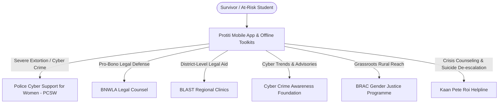
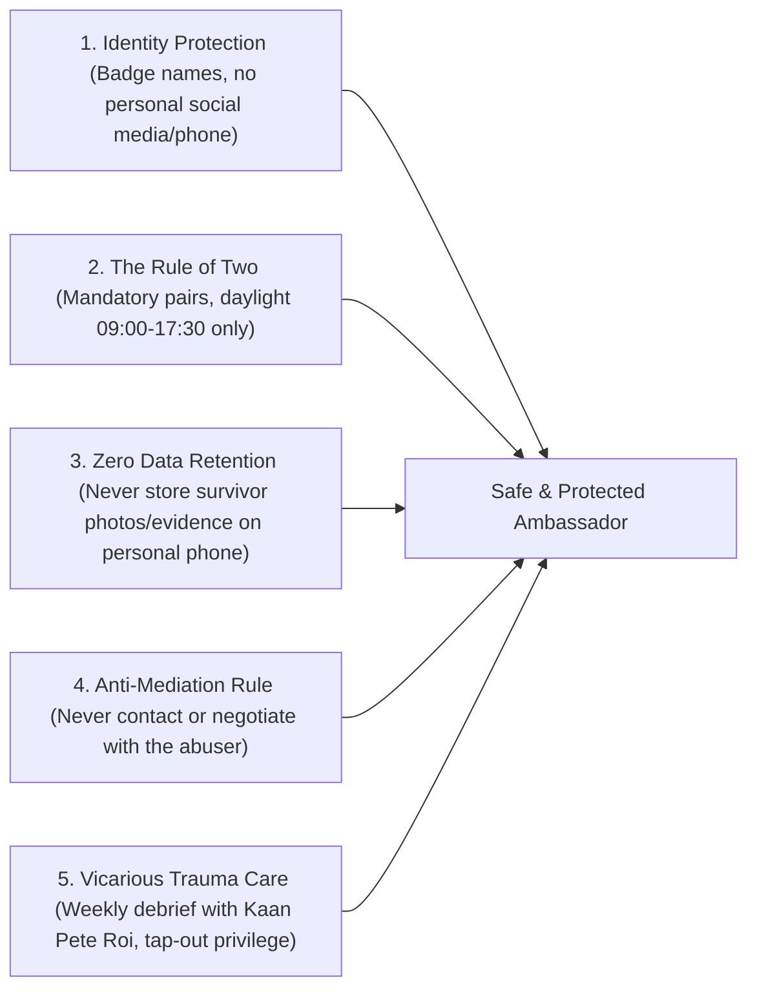

# Project Protiti (প্রতীতি) — Community & Outreach Handoff: Complete GTM Readiness
**DKC Digital Respect & Cohesion Fellowship 2026 | UNDP Bangladesh, EU & SURGE**
*Author: Community & Outreach Lead Agent | Date: September 25, 2026*

---

## 1. Overview & Strategic Mandate

Project Protiti addresses gender-based online violence (OGBV) across Bangladesh by pairing a secure, offline-first digital evidence vault with an aggressive grassroots outreach strategy. This document provides the complete, production-ready **Go-To-Market (GTM) and Community Engagement Blueprint** for the 8-month fellowship lifecycle (October 2026 – May 2027).

It directly synthesizes and operationalizes the three core field documents:
1. [8-Division Rollout & Grassroots Implementation Plan](file:///Users/blackbird/Everything/dev/DKC/pitch_materials/eight_divisions_rollout.md)
2. [BDT 50,000 Seed Grant Budget Allocation](file:///Users/blackbird/Everything/dev/DKC/pitch_materials/budget_50k.md)
3. [Ambassador Safeguarding & Duty of Care Protocol](file:///Users/blackbird/Everything/dev/DKC/pitch_materials/ambassador_safeguarding_protocol.md)

---

## 2. Updated Train-the-Trainer (ToT) Campus Ambassador Syllabus

The 64 Campus Ambassadors (8 per administrative division) undergo an accredited, intensive **2-Day Hybrid Certification Workshop** before conducting campus or dormitory outreach.

```
┌────────────────────────────────────────────────────────────────────────┐
│                   TRAIN-THE-TRAINER (ToT) CURRICULUM                   │
├───────────────────────────────────┬────────────────────────────────────┤
│ DAY 1: LAW, FORENSICS & APP       │ DAY 2: PEER SUPPORT & SAFEGUARDING │
├───────────────────────────────────┼────────────────────────────────────┤
│ 09:00 - 10:30 Cyber Protection    │ 09:00 - 10:30 Trauma-Informed      │
│ Act 2026 & Legal Admissibility    │ First Response (Kaan Pete Roi)     │
│ 10:45 - 12:45 Evidence Vault,     │ 10:45 - 12:45 4-Tier Crisis Triage │
│ SHA-256 Hashing & Disguise Modes  │ & Hotlines (PCSW, 999, BNWLA)      │
│ 13:45 - 15:30 GD Automator &      │ 13:45 - 15:30 Safe Campus Kiosks   │
│ Police e-GD Integration Lab       │ & Hall Circle Simulation           │
│ 15:45 - 17:00 Shared-Device Threat│ 15:45 - 17:00 Safeguarding Pledge, │
│ Modeling & Counter-Surveillance   │ Non-Mediation Rule & Certification │
└───────────────────────────────────┴────────────────────────────────────┘
```

### Day 1: Legal Frameworks, Evidence Vault Architecture & Law Enforcement
* **09:00 AM – 10:30 AM: Legal Landscape (Cyber Protection Act 2026)**
  * Transition from the repealed CSA 2023 to the **Cyber Protection Act 2026** and the **Pornography Control Act 2012**.
  * Specific provisions criminalizing revenge pornography, sextortion, non-consensual image distribution, and AI-generated deepfakes.
  * Formulating complaints that satisfy statutory evidentiary requirements.
* **10:45 AM – 12:45 PM: Evidence Vault Mechanics & Digital Forensics**
  * Why standard screenshots are rejected in court; EXIF data stripping.
  * Technical lab: Local AES-256 database encryption, automated SHA-256 hashing on capture, and forensic PDF export with embedded timestamps.
* **01:45 PM – 03:30 PM: GD-Automator & Police Station Interface**
  * Practical workshop: Drafting General Diary (GD) complaints in Bengali and English.
  * Integration with the Bangladesh Police Online GD portal (`gd.police.gov.bd`) vs. physical submission at local Thanas.
  * Utilizing the offline localized Thana directory across all 64 districts.
* **03:45 PM – 05:00 PM: Shared Devices, Counter-Surveillance & Duress PIN**
  * Threat modeling for victims whose phones are scrutinized by abusive partners or family members.
  * Operating the Calculator Disguise Mode, Duress PIN (which loads a blank decoy vault), "shake-to-hide" accelerometer triggers, and emergency cache wiping.

### Day 2: Trauma-Informed Peer Support, Triage & Field Safeguarding
* **09:00 AM – 10:30 AM: Trauma-Informed Communication & De-Escalation**
  * Psychological First Aid (PFA) for survivors experiencing acute panic or shame.
  * Active listening, non-judgmental validation, and strict avoidance of victim-blaming language.
  * Session conducted in collaboration with accredited mental health trainers from **Kaan Pete Roi**.
* **10:45 AM – 12:45 PM: Crisis Triage & Referral Escalation Matrix**
  * Standardized four-tier traffic-light protocol:
    * *Tier 1 (Green - Info):* Walkthrough of safety features, app installation, survivor wallet card.
    * *Tier 2 (Yellow - Harassment):* Vault evidence lock, draft GD generation, e-GD guidance.
    * *Tier 3 (Orange - Blackmail/Deepfakes):* Immediate hotline escalation to **PCSW (01320000888)** and **BNWLA** pro-bono attorneys.
    * *Tier 4 (Red - Danger/Self-Harm):* Immediate call to **999**, Kaan Pete Roi helpline, and Hall Provost.
* **01:45 PM – 03:30 PM: Campus Activation, Dormitory Kiosks & Toolkit Distribution**
  * Setting up low-profile "Digital Health Check" kiosks in female residential hall common rooms, student cafeterias, and library lounges.
  * Safe, discreet dissemination of the physical folding survivor wallet cards.
* **03:45 PM – 05:00 PM: Ambassador Safeguarding, Code of Conduct & Certification**
  * Detailed review of the **Ambassador Safeguarding Protocol**: Mandatory Rule of Two (Buddy System), daylight-only hours (09:00 AM – 05:30 PM), Zero Local Data Retention rule, and the strict Anti-Mediation directive (never contact abusers).
  * Formal signing of the Ambassador Pledge and issuance of credentials.

---

## 3. Formalized Multi-Sector Strategic Partnerships

To guarantee that the app connects victims to tangible, institutional protection, Protiti is integrated with leading national entities:



1. **Police Cyber Support for Women (PCSW) — Official Law Enforcement Channel**
   * *Role:* Fast-track escalation for high-urgency cyber harassment, revenge porn, and extortion cases.
   * *Operational Link:* Dedicated direct-dial hotline (`01320000888`), official email integration (`cyberhelp@police.gov.bd`), and pre-formatted evidence dossiers aligned with CID Cyber Police Centre intake criteria.
2. **Bangladesh National Woman Lawyer's Association (BNWLA) — Legal Counsel**
   * *Role:* Pro-bono legal consultation, case filing, and courtroom representation for victims under the Cyber Protection Act 2026.
   * *Operational Link:* BNWLA panel attorneys review and validate Protiti's automated GD templates to guarantee judicial admissibility; direct referral bridge in the app.
3. **Bangladesh Legal Aid and Services Trust (BLAST) — Divisional Legal Clinics**
   * *Role:* Physical legal accompaniment in district courts outside Dhaka for marginalized, rural, and indigenous women.
   * *Operational Link:* Embedded clinic addresses and verified phone lines across all 8 administrative divisions.
4. **Cyber Crime Awareness Foundation (CCA Foundation) — Knowledge Partner**
   * *Role:* Continuous monitoring of emerging cyber harassment trends (deepfakes, botnets, financial extortion).
   * *Operational Link:* Co-branded educational modules and joint national cybersecurity advisories.
5. **BRAC Gender Justice & Diversity Programme — Peri-Urban & Grassroots Reach**
   * *Role:* Reaching women outside elite university circles via BRAC's grassroots community networks and Union Digital Centres (UDCs).
   * *Operational Link:* Physical toolkit distribution through BRAC Community Empowerment Clubs in Khulna, Barishal, and Rangpur.
6. **Kaan Pete Roi — Psychosocial & Emotional Support**
   * *Role:* Professional mental health support for survivors suffering from severe trauma or depression.
   * *Operational Link:* Confidential crisis counseling hotline integration (`01779554391` / `01779554392`) and weekly debriefing circles for student ambassadors.

---

## 4. 8-Division Rollout Schedule & Campus Anchor Matrix

The rollout spans the entire 8-month fellowship lifecycle, covering all 8 administrative divisions of Bangladesh:

| Division | Primary Campus Anchors | Priority Thanas & Hotspots | Community & Dialect Focus | Timeline |
|---|---|---|---|---|
| **Dhaka** | DU, JU, Eden Mohila College, BRACU, NSU | Shahbagh, Dhanmondi, Badda, Bhatara, Savar Model | High-density dormitories, non-consensual deepfakes, online blackmail | Month 1–2 (Oct–Nov 2026) |
| **Chattogram** | CU (Hathazari), AUW, CUET, Chittagong College | Hathazari Model, Kotwali, Panchlaish, Rangamati Sadar | Commercial cyber fraud; indigenous CHT women's network; Chittagonian dialect adaptation | Month 3 (Dec 2026) |
| **Sylhet** | SUST (Kumargaon), SAU, MC College | Jalalabad, Kotwali Model Sylhet, Beanibazar | Transnational/diaspora harassment, conservative social stigma, Sylheti dialect | Month 3 (Dec 2026) |
| **Rajshahi** | RU (Motihar), RUET, Rajshahi College | Motihar, Boalia Model, Godagari, Bogura Sadar | Off-campus student housing ("Mess") hidden camera protection, BLAST clinic integration | Month 4 (Jan 2027) |
| **Khulna** | KU (Gollamari), KUET, BL College, JUST | Harintana, Khalishpur, Daulatpur, Kotwali Jashore | Coastal trafficking intersections, romance scams, Union Digital Centre (UDC) outreach | Month 5 (Feb 2027) |
| **Barishal** | BU (Karnakathi), BM College, PSTU | Bandar (River port), Kotwali Model Barishal, Bakerganj | Riverine connectivity constraints; offline toolkit distribution; voice-guided literacy | Month 5 (Feb 2027) |
| **Rangpur** | BRUR, Carmichael College, HSTU (Dinajpur) | Tajhat, Kotwali Rangpur, Dinajpur Sadar, Kurigram | Child marriage prevention via blackmail interdiction; indigenous Santal community inclusion | Month 4 (Jan 2027) |
| **Mymensingh** | BAU, JKKNIU (Trishal), Ananda Mohan College | Kotwali Model Mymensingh, Trishal, Netrokona Sadar | Rural campus sprawling layouts; indigenous Garo youth inclusion along border upazilas | Month 6 (Mar 2027) |
| **National** | All 8 Divisional Hubs Consolidated | National Police Cyber Desks & Proctorial Offices | **DKC National Showcase (Feb 2027)** & Final Handover (Apr–May 2027) | Month 7–8 (Apr–May 2027) |

---

## 5. BDT 50,000 Seed Grant Allocation Breakdown

The budget strictly follows the fellowship rules: **BDT 50,000 total, disbursed in two equal tranches of BDT 25,000, 100% dedicated to project execution with zero personal stipends or overhead deductions**.

```
┌────────────────────────────────────────────────────────────────────────┐
│             PROJECT PROTITI — BDT 50,000 SEED GRANT BUDGET             │
├─────────────────────────────────────────────────┬──────────┬───────────┤
│ Category Description                            │ BDT Cost │ % Share   │
├─────────────────────────────────────────────────┼──────────┼───────────┤
│ Cat A: Survivor Toolkits & Field Print Assets   │  18,200  │   36.4%   │
│ Cat B: Campus & Community Workshop Logistics    │  11,200  │   22.4%   │
│ Cat C: Ambassador Local Transport (8 Divisions) │  12,000  │   24.0%   │
│ Cat D: Digital Connectivity & Hotline SIMs      │   6,000  │   12.0%   │
│ Cat E: Inter-Divisional Courier & Audit Docs    │   2,600  │    5.2%   │
├─────────────────────────────────────────────────┼──────────┼───────────┤
│ GRAND TOTAL (Strictly zero stipend)             │  50,000  │  100.0%   │
└─────────────────────────────────────────────────┴──────────┴───────────┘
```

* **Tranche 1 (BDT 25,000 | Oct 2026):** 6,000 folding survivor cards (BDT 7,800); 80 Master Handbooks (BDT 5,200); Refreshments for 4 workshops (BDT 4,400); Stationery for 4 hubs (BDT 1,200); Ambassador travel pool for 4 hubs (BDT 6,000); Regional courier dispatch (BDT 400).
* **Tranche 2 (BDT 25,000 | Jan 2027):** 4,000 folding survivor cards (BDT 5,200); Refreshments for remaining 4 workshops (BDT 4,400); Stationery for 4 hubs (BDT 1,200); Ambassador travel pool for 4 hubs (BDT 6,000); 8 Dedicated SIMs & data packs (BDT 6,000); Courier & audit binder documentation (BDT 2,200).

---

## 6. Ambassador Safeguarding & Duty of Care Summary

Female university students are protected by five non-negotiable operational safeguards:



* **Strict Non-Accompaniment to Thanas:** Ambassadors never enter a police station to confront officers on behalf of a victim; cases requiring physical accompaniment are handed to BNWLA/BLAST pro-bono lawyers or the university proctor.
* **Emergency "Red Alert" Protocol:** Sending `PROTITI_SAFE` via SMS/Telegram instantly activates emergency extraction, security mobilization with university authorities, and immediate BNWLA legal shielding.

---

## 7. Concrete Go-To-Market Assets & Deliverables

1. **Discreet Physical Survivor Toolkits (10,000 Units Printed):**
   * Pocket-sized 4-panel folding card (credit-card dimensions) disguised as a cosmetics/loyalty card.
   * Contains offline emergency numbers (999, PCSW, BNWLA, Kaan Pete Roi), 5 evidence preservation rules, Cyber Protection Act 2026 rights summary, and offline Protiti QR code.
2. **Ambassador Master Training Handbook (80 Copies Spiral-Bound):**
   * 24-page B5 compendium of legal clauses, evidence hashing technical scripts, de-escalation roleplays, and safeguarding directives.
3. **Dedicated Divisional Support Hotlines:**
   * 8 project-owned SIM cards providing verified, confidential triage and referral routing.
4. **Campus Kiosk Activation Kits:**
   * Foldable banners, privacy clipboards, anonymous incident loggers, and offline APK installation flash drives.

---

## 8. Measurable Impact KPIs & Fellowship Success Metrics

| Key Metric | 8-Month Target | Verification & Source of Truth |
|---|---|---|
| **Certified Ambassadors** | 64 Female Student Leaders across 8 divisions (8 per division) | Training logs, signed pledges, practical exam records |
| **Direct Peer Outreach** | 8,000+ Female University and College Students | Workshop attendance slips, kiosk registration rosters |
| **Physical Toolkits Disseminated** | 10,000 Discreet survivor wallet cards | Print house invoices, signed courier challans |
| **Evidence Vaults Activated** | 3,500+ Secure Vaults installed | Privacy-preserving client-side telemetry counter |
| **Actionable Complaints Drafted** | 500+ Cryptographically verified GD/e-GD drafts generated | Anonymized intake logs, partner legal desk records |
| **Thana Acceptance Rate** | >85% Acceptance by Duty Officers without formatting rejection | Quarterly BNWLA & PCSW liaison reviews |
| **Emergency Escalations** | 100% of high-threat cases routed to PCSW/999 within 15 minutes | Support Bridge emergency escalation logs |
| **Ambassador Safety Record** | 0 Safety breaches, 0 doxxing incidents, 0 legal liabilities | Weekly security check-in audit with National Coordinator |

---

## 9. Cross-Team Action Items & Readiness Checklist

* **For Engineering (Dev Team):**
  * Finalize the Calculator Disguise Mode and Duress PIN (which wipes/displays decoy screen).
  * Ensure the local SQLite/SQLCipher database generates SHA-256 hashes completely offline.
  * Implement the lightweight USSD/SMS panic alert (sending Lat/Long + battery level without heavy media).
* **For Design (UI/UX Team):**
  * Review the printed 4-panel survivor wallet card layout for discreet aesthetics (disguised as cosmetics/store card).
  * Ensure the app UI provides full Bengali localization with clear iconography for low-stress navigation.
* **For Legal & Research Desk:**
  * Complete Section 25 and Section 40 clause mapping under the Cyber Protection Act 2026 for automated GD population.
  * Finalize pro-bono referral MOUs with BNWLA and BLAST district offices.
* **For Pitch & Presentation Lead:**
  * Embed the BDT 50,000 budget chart and 8-division map into Slide 6 and Slide 7 of `pitch_materials/pitch_deck.md`.
  * Highlight the Ambassador Safeguarding Protocol as a direct rebuttal to the judge's critique regarding ground-level safety and feasibility.

---
*Ready for immediate deployment upon DKC Fellowship award.*
