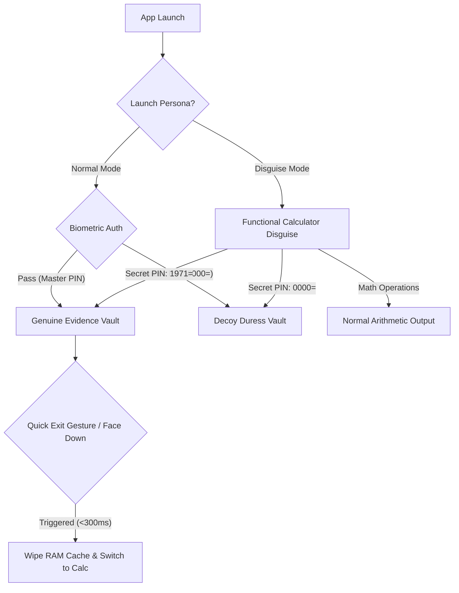

# Design System & Brand Handoff: Protiti (প্রতীতি)

**Document Version:** 2.0  
**Project:** Project Protiti — Digital Evidence Vault & Legal GD Automator  
**Fellowship:** DKC Fellowship 2026 (UNDP Bangladesh)  
**Theme:** Gender-Based Online Violence Mitigation  
**Classification:** Core Brand, UX Architecture & Engineering Handoff  

---

## 1. Brand Naming & Epistemological Strategy

Following a comprehensive brand uniqueness audit across Bangladesh civic tech, UNDP project registries, and Google Play:

### Official Brand Name: **Protiti (প্রতীতি)**
* **Bengali Script:** **প্রতীতি**
* **Phonetics:** */pro-t̪i-t̪i/ (Pro-tee-tee)*
* **Linguistic Root & Meaning:** Derived from classical Bengali epistemology (*Nyaya* philosophy). *Protiti* signifies **"Deep Conviction," "Undisputed Certitude,"** and **"The Realization of Truth through Valid Proof."** It captures the decisive moment when forensic evidence dissolves doubt and truth becomes legally and socially undeniable.
* **Tagline:**
  * *Bangla:* **"সন্দেহহীন সত্য, অকাট্য প্রমাণের অধিকার।"**
  * *English:* **"From Doubt to Certitude: Structure for Digital Justice"**

### Strategic Differentiation:
1. **Aparajita (অপরাজিতা) — Dropped:** Heavily saturated across UNDP Bangladesh (*Aparajita: Women's Political Empowerment*), BRAC, and microfinance NGOs. Tipped off abusers due to universal GBV association.
2. **Abhaya (অভয়া) — Dropped:** Saturated by post-2024 regional protest initiatives and municipal police apps (e.g., Asansol-Durgapur 'Abhaya').
3. **Shield-Frame (Working Code Name) — Replaced:** Too technical and militaristic for trauma survivors.
4. **Protiti Uniqueness:** 100% collision-free in civic tech, deep cultural resonance with Bangladeshi youth (ages 18–35) through music and literature, and neutral enough to blend innocuously onto a smartphone home screen.

---

## 2. Color Palette & Token Hierarchy

To transcend stereotypical "security app" tropes (harsh militaristic grays or alarming emergency reds), Protiti employs a palette that balances **sovereign dignity**, **forensic clarity**, and **calm reassurance**.

```
┌────────────────────────────────────────────────────────────────────────┐
│  DEEP AMETHYST (#4A154B)        TEAL (#008080)        WARM GOLD (#FFC107) │
│  Primary Brand / Dignity        Forensic Clarity      Authenticity / Certitude │
├────────────────────────────────────────────────────────────────────────┤
│  CRIMSON RED (#D32F2F)         ALABASTER (#F8F9FA)   SOFT CHARCOAL (#121212)  │
│  Emergency SOS / High Alert     Light Surface         Dark Operational Surface │
└────────────────────────────────────────────────────────────────────────┘
```

### Color Specification Table

| Token Name | Hex Code | Semantic Role & Psychology | Contrast on Charcoal (#121212) |
|---|---|---|---|
| `amethyst-primary` | `#4A154B` | Dignity, institutional strength, non-threatening authority | 2.5:1 (use with gold/white text) |
| `amethyst-dark` | `#2C0B2D` | App bars, deep containers, header gradients | 1.8:1 (background container) |
| `amethyst-light` | `#6B2B6D` | Button hover states, elevated card borders | 3.6:1 |
| `teal-primary` | `#008080` | Clarity, hope, verification, forensic confirmation | 4.8:1 (WCAG AA Compliant) |
| `teal-light` | `#20B2AA` | Active icons, progress indicators, link highlights | 8.2:1 (WCAG AAA Compliant) |
| `teal-dark` | `#005959` | Secondary background fills, badge backgrounds | 2.6:1 |
| `gold-accent` | `#FFC107` | Certitude, verified badges, focal points, primary CTAs | 12.4:1 (WCAG AAA Compliant) |
| `crimson-danger` | `#D32F2F` | Emergency panic SOS, irreversible purge confirmations | 4.5:1 (WCAG AA Compliant) |
| `crimson-bright` | `#E53935` | Pulsing SOS active state, critical alerts | 5.8:1 (WCAG AA Compliant) |
| `surface-dark` | `#121212` | Default operational background (prevents nighttime glare) | N/A (Base) |
| `surface-card` | `#1E1E1E` | Card surface, list containers, bottom sheets | N/A (Card base) |
| `surface-elevated`| `#282828` | Dialogs, elevated popovers, input fields | N/A (Elevated base) |
| `surface-light` | `#F8F9FA` | Alabaster export canvas (GD print PDF, legal export) | Base (Light) |
| `text-primary` | `#FFFFFF` | Primary headings, button titles, status indicators | 21:1 (WCAG AAA) |
| `text-secondary`| `#A0AEC0` | Metadata labels, timestamps, secondary body | 6.8:1 (WCAG AA) |

---

## 3. Bilingual Typography & Scale System

The interface must deliver flawless legibility under acute stress. It features an integrated bilingual system pairing **Poppins** (English headings) and **Inter** (English body/metadata) with **Hind Siliguri** or **Noto Sans Bengali** (Bengali UI and formal General Diary generation), plus **JetBrains Mono** for forensic hashes and timestamps.

### Typographic Hierarchy

| Role | Font Family | Weight | Size | Line Height | Tracking | Use Case |
|---|---|---|---|---|---|---|
| **Display / Hero** | Poppins / Hind Siliguri | Bold (700) | 28px | 36px | -0.02em | Lock screen greeting, SOS heading |
| **Heading 1 (H1)** | Poppins / Hind Siliguri | SemiBold (600) | 22px | 28px | -0.01em | Screen headers (Vault, GD Automator) |
| **Heading 2 (H2)** | Poppins / Hind Siliguri | SemiBold (600) | 18px | 24px | 0.0em | Section cards, modal headers |
| **Heading 3 (H3)** | Poppins / Hind Siliguri | Medium (500) | 15px | 20px | 0.0em | Evidence card titles, step labels |
| **Body Large** | Inter / Hind Siliguri | Regular (400) | 16px | 24px | 0.0em | Incident descriptions, help articles |
| **Body Medium** | Inter / Hind Siliguri | Regular (400) | 14px | 20px | 0.0em | General Diary body text, forms |
| **Caption / Meta** | Inter / Hind Siliguri | Medium (500) | 12px | 16px | +0.01em | Timestamps, platform tags |
| **Forensic Mono** | JetBrains Mono | Medium (500) | 11px | 15px | +0.02em | SHA-256 hashes, coordinates, GPS |

### Bilingual Pairing Rules
1. **Bengali Optical Size Compensation:** Bengali glyphs in *Hind Siliguri* have prominent upper *matra* lines and lower loops. When rendering bilingual labels side-by-side, scale Bengali text to **+1px** relative to English to achieve equal perceived optical x-height.
2. **Generous Leading for Bengali:** Maintain minimum line-height of **1.55x** for Bengali paragraphs to avoid clipping complex conjuncts (*juktakkhor* যেমন: ক্ষ, ঙ্ক, ঙ্গ, ণ্ট).
3. **Monospace for Legal Integrity:** All cryptographic checksums, Ed25519 signatures, and BDT timestamps must render strictly in `JetBrains Mono` to prevent ambiguity between `0` and `O` or `1` and `l`.

---

## 4. Trauma-Informed UX & Microcopy Framework

Victims of online harassment experience elevated cortisol, cognitive tunneling, reduced fine motor skills (tremors), and acute fear of discovery. Every microcopy string and interaction pattern must respect these psychological realities.

### Core Principles
1. **Survivor Agency:** Never automate irrevocable decisions without transparent explanation. The user always owns the evidence.
2. **Non-Accusatory Emotional Neutrality:** Eliminate judgmental or sensational language ("proof of attack", "victim testimony"). Use objective, protective language ("secure item", "survivor note").
3. **Predictability:** Always explain what will happen before an action occurs (e.g., *"Exporting will create a password-protected PDF on your device"*).
4. **Tremor Resilience:** Touch targets must be **minimum 48x48 dp** with minimum 8 dp spacing between interactive targets.
5. **Reassurance over Alarms:** Error states must explain how to resolve the issue calmly without red flashing banners unless it is the dedicated Panic SOS.

### Microcopy Standards Matrix

| Scenario / Context | ❌ Triggering Anti-Pattern | ✅ Protiti Trauma-Informed Standard | Bengali Standard (প্রতীতি মান) |
|---|---|---|---|
| **Evidence Ingestion** | "Upload Proof of Abuse / Crime" | "Secure Item in Encrypted Vault" | "প্রমাণ ভল্টে সুরক্ষিত করুন" |
| **Evidence Details** | "Describe how the perpetrator attacked you" | "Add Context Note (Optional)" | "ঘটনার সংক্ষিপ্ত নোট যোগ করুন (ঐচ্ছিক)" |
| **General Diary (GD)** | "File Criminal Complaint against Accused" | "Draft Legal General Diary (GD)" | "আইনি জিডি (GD) খসড়া তৈরি করুন" |
| **Evidence Integrity** | "Check if file is hacked or modified" | "Hardware Key Attestation & Chain of Custody Verified" | "ক্রিপ্টোগ্রাফিক সুরক্ষা ও চেইন-অব-কাস্টডি নিশ্চিত" |
| **Emergency Trigger** | "Press if you are being attacked" | "Hold 3 seconds to alert your trusted circle" | "বিশ্বস্ত অভিভাবককে সতর্ক করতে ৩ সেকেন্ড ধরে রাখুন" |
| **False Alarm / Reset** | "Cancel Emergency Attack Alert" | "Cancel SOS Beacon (5s Grace Period)" | "জরুরি সংকেত বাতিল করুন (৫ সেকেন্ড সুযোগ)" |
| **App Disguise Switch** | "Hide GBV App from Partner" | "Switch to Discreet Calculator View" | "গোপন ক্যালকুলেটর মোডে যান" |
| **Safe Rapid Exit** | "Close App" | "Quick Exit (Double-tap or screen flip)" | "দ্রুত প্রস্থান (স্ক্রিন উল্টান বা দুইবার চাপুন)" |
| **Item Deletion** | "Delete Evidence Forever" | "Remove from Vault (Will invalidate legal hash)" | "ভল্ট থেকে অপসারণ (আইনি হ্যাশ বাতিল হবে)" |

---

## 5. Stealth Launcher & Privacy Architecture

The physical safety of the survivor is paramount. If an abuser demands device access, Protiti must never betray its true purpose.



### 1. Multi-Persona Disguises
* **Persona A: "Smart Calc" (Official Disguise):** A fully functional calculator app that performs accurate arithmetic. Entering the master unlock code (e.g., `1971=`) immediately unlocks the Genuine Vault. Entering `0000=` unlocks the Decoy Vault.
* **Persona B: "Daily Notes" (Alternative Disguise):** An offline grocery and study notepad. Long-pressing the top navigation bar opens the hidden PIN prompt.
* **Persona C: "Protiti Journal" (Default Unmasked Persona):** A reflective personal journal brand that does not overtly advertise "GBV" or "police evidence".

### 2. Dual-Vault (Duress PIN) Architecture
* **Master PIN / Fingerprint:** Decrypts the master SQLCipher database containing forensic screenshots, audio recordings, timestamps, and police GD drafts.
* **Duress PIN (`0000=`):** If coerced at knifepoint or under abusive family supervision, entering the Duress PIN decrypts an entirely isolated **Decoy Database** populated with realistic university course materials, harmless recipes, and campus photography. No forensic logs or evidence records are visible, and zero UI hints indicate that another partition exists.

### 3. Dynamic Launcher Icon Switching (OS Implementation)
* **Android:** Configured via multiple `<activity-alias>` declarations in `AndroidManifest.xml`. When Disguise Mode is toggled in Settings, `PackageManager.setComponentEnabledSetting()` disables the `ProtitiMainActivity` alias and enables `CalculatorMainActivity` with an innocuous calculator icon (`ic_calculator.png`).
* **iOS:** Utilizes `UIApplication.shared.setAlternateIconName("CalculatorIcon")`.

### 4. Discrete Notification Channel Masking
* Push notifications and background backup alerts are routed through a masked Android `NotificationChannel` registered as `system_storage_sync` under the user-visible title **"System Storage Diagnostics"**.
* **Zero Preview Text:** Push payloads contain no sensitive strings. Notifications display generic system verbiage: *"Storage optimization complete"* or *"3 items synced to offline cache"*.
* All sensitive evidence synchronization occurs over encrypted background workers with `NotificationManager.IMPORTANCE_LOW` (no sound, no heads-up banner).

### 5. Rapid Quick-Exit Gesture Specifications
* **Face-Down Flip:** Utilizing the device accelerometer and proximity sensor (`Sensor.TYPE_PROXIMITY` + `Sensor.TYPE_ACCELEROMETER`), placing the phone face-down on a table or leg immediately clears the screen, purges unencrypted database buffers from RAM, and switches the active foreground view to the Calculator.
* **Double-Tap Power Button / 3-Finger Swipe Down:** Triggers immediate window detachment.
* **Recent Apps Screen Masking:** The Android activity sets `WindowManager.LayoutParams.FLAG_SECURE`, preventing screenshots and blurring the app snapshot in the OS Recent Tasks / App Switcher view.

---

## 6. UI Component Standards

### 1. Evidence Card Anatomy
* **Thumbnail Container (h-24):** High-contrast dark gradient with platform badge top-left (Facebook blue, Instagram gradient, WhatsApp green, SMS red) and `HASHED` forensic badge top-right.
* **Integrity Tag:** Cryptographic status pill in `JetBrains Mono` (`SHA-256 SEALED`).
* **Metadata Footnote:** Exact timestamp in BDT (Bangladesh Standard Time, UTC+6) and file size.
* **Interactive Inspection Modal:** Tapping an evidence card triggers an inspector displaying the complete 64-character SHA-256 hash, device hardware key attestation (Android StrongBox / iOS Secure Enclave), and legal admissibility classification under Cyber Security Act 2023.

### 2. Stepper & Legal GD Automator
* **Progress Tracker:** 4-segment linear indicator displaying active, completed, and pending steps.
* **Live General Diary (GD) Preview:** Real-time synchronized bilingual preview formatted according to official Dhaka Metropolitan Police (DMP) General Diary filing standards:
  * Addressing the Officer-in-Charge (OC) of the jurisdiction's Model Thana.
  * Formal application subject line (*"সাইবার হুমকি ও হয়রানি সংক্রান্ত সাধারণ ডায়েরি করার আবেদন"*).
  * Narrative of incident with integrated cryptographic hash annexure references.
* **CSA Section Tagger:** Automatically recommends relevant legal provisions based on evidence tags (e.g., Section 25 for false/threatening content, Section 29 for defamation, Section 24 for impersonation).

### 3. Rapid 1-Second Panic SOS Flow
* **Zero Navigation Depth:** Accessible from the main bottom navigation bar with one tap.
* **Hold-to-Trigger Button:** 144px central circular trigger surrounded by an SVG radial progress ring (`stroke-dasharray="540"`).
* **3-Second Tactile Ramp:** Requires a continuous 3-second hold to eliminate accidental triggers. The ring progressively fills in crimson red `#D32F2F`, with haptic feedback vibrations every 500ms.
* **5-Second Grace Cancellation Period:** Once triggered, a 5-second countdown banner allows immediate false-alarm cancellation before the encrypted GPS beacon and vault access tokens are dispatched to the user's Trusted Circle.
* **Direct Emergency Hotlines:** Direct-dial access buttons to National Emergency Services (`999`), Cyber Police Centre (`01320-000888`), and Violence Against Women Helpline (`109`).

### 4. Support Bridge Directory
* **Vetted Pro-Bono Providers:** Pre-screened NGO legal clinics (e.g., Bangladesh National Woman Lawyers' Association — BNWLA, Ain o Salish Kendra — ASK) and trauma helplines (Kaan Pete Roi).
* **Division-Wise Filtering:** Quick division pills (Dhaka, Chattogram, Rajshahi, Khulna, Sylhet, Barishal, Rangpur, Mymensingh).

---

## 7. Deliverables & Handoff Assets

| Deliverable Asset | Location / File Path | Status | Purpose |
|---|---|---|---|
| **Interactive HTML Mockup** | `pitch_materials/protiti_mockup.html` | ✅ Complete | Responsive, interactive prototype with bilingual toggle, decoy vault, stealth calculator, and panic SOS hold simulation. |
| **Flutter Theme Tokens** | `protiti/lib/ui/core/theme/app_theme.dart` | ✅ Complete | Official Dart theme tokens for Light and Dark modes with Protiti Amethyst, Teal, Gold, and Crimson color schemes. |
| **Design System Specification** | `team_handoffs/design_handoff.md` | ✅ Complete | This comprehensive document covering typography, color hierarchy, trauma UX, and stealth launcher specs. |
| **Pitch Presentation Slides** | `pitch_materials/pitch_deck.md` | ✅ Synced | Fellowship pitch deck incorporating Protiti branding, statistics, and legal framework. |

---

## 8. Developer Implementation Checklist

- [x] **Theme Token Integration:** Verified `AppTheme.darkTheme` and `AppTheme.lightTheme` in Flutter codebase.
- [ ] **Custom Font Bundling:** Add Google Fonts (`Poppins`, `Inter`, `Hind Siliguri`, `JetBrains Mono`) to `pubspec.yaml` assets for offline accessibility.
- [ ] **Dual-Database Encryption:** Configure `sqflite` + `sqlcipher_flutter_libs` with distinct encryption keys derived from Master PIN vs. Duress PIN (`0000`).
- [ ] **Window Security Flag:** Add `FLAG_SECURE` in Android `MainActivity.kt` to disable screenshots and OS app switcher caching.
- [ ] **Proximity Sensor Listener:** Bind `sensors_plus` to listen for face-down flip gestures and execute immediate calculator disguise fallback.
- [ ] **Panic Button Haptic Feedback:** Bind `vibration` / `haptic_feedback` to the 3-second hold-down animation cycle.
